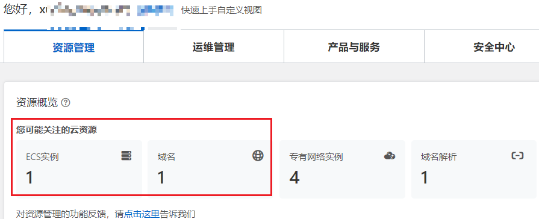
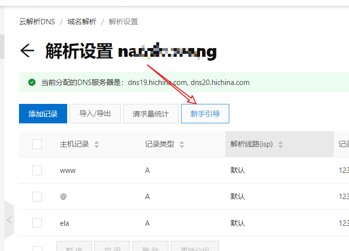
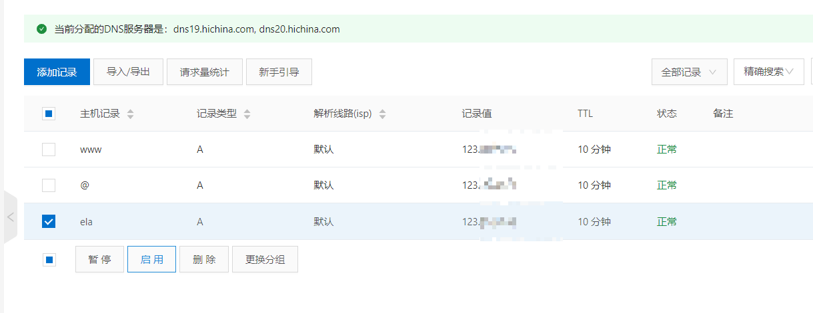
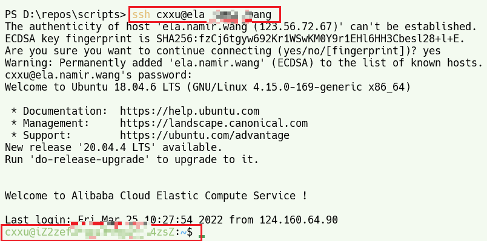

# 绑定阿里云主机和域名

## reference

* [doc虚拟云主机绑定域名 (aliyun.com)](https://help.aliyun.com/document_detail/36134.html#:~:text=%E5%9C%A8%E5%9F%9F%E5%90%8D%E7%BB%91%E5%AE%9A%E9%A1%B5%E9%9D%A2%EF%BC%8C%E5%8D%95%E5%87%BB%E7%BB%91%E5%AE%9A%E5%9F%9F%E5%90%8D%E3%80%82%20%E8%B4%AD%E4%B9%B0%E4%BA%91%E8%99%9A%E6%8B%9F%E4%B8%BB%E6%9C%BA%E5%90%8E%EF%BC%8C%E9%98%BF%E9%87%8C%E4%BA%91%E4%BC%9A%E4%B8%BA%E6%82%A8%E7%9A%84%E4%BA%91%E8%99%9A%E6%8B%9F%E4%B8%BB%E6%9C%BA%E8%87%AA%E5%8A%A8%E7%BB%91%E5%AE%9A%E4%B8%80%E4%B8%AA%E4%B8%B4%E6%97%B6%E5%9F%9F%E5%90%8D%EF%BC%8C%E8%AF%A5%E5%9F%9F%E5%90%8D%E7%94%B1%E9%98%BF%E9%87%8C%E4%BA%91%E5%85%8D%E8%B4%B9%E6%8F%90%E4%BE%9B%E4%B8%94%E5%B7%B2%E5%AE%8C%E6%88%90%E8%A7%A3%E6%9E%90%E5%92%8C%E5%A4%87%E6%A1%88%EF%BC%8C%E5%B9%B6%E4%B8%94%E4%B8%B4%E6%97%B6%E5%9F%9F%E5%90%8D%E4%B8%8D%E5%8F%AF%E5%88%A0%E9%99%A4%E3%80%82%20%E5%9C%A8%E5%BC%B9%E5%87%BA%E7%9A%84%E7%BB%91%E5%AE%9A%E5%9F%9F%E5%90%8D%E5%AF%B9%E8%AF%9D%E6%A1%86%EF%BC%8C%E6%82%A8%E5%8F%AF%E4%BB%A5%E8%BE%93%E5%85%A5%E5%9F%9F%E5%90%8D%E4%B9%9F%E5%8F%AF%E4%BB%A5%E9%80%89%E6%8B%A9%E6%82%A8%E8%B4%A6%E6%88%B7%E4%B8%8B%E7%9A%84%E4%B8%87%E7%BD%91%E5%9F%9F%E5%90%8D%EF%BC%8C%E5%B9%B6%E6%A0%B9%E6%8D%AE%E6%82%A8%E7%9A%84%E5%9F%9F%E5%90%8D%E8%A7%A3%E6%9E%90%E7%8A%B6%E5%86%B5%E9%80%89%E6%8B%A9%E6%98%AF%E5%90%A6%E4%BD%BF%E7%94%A8%E9%98%BF%E9%87%8C%E4%BA%91%E8%A7%A3%E6%9E%90%E6%9C%8D%E5%8A%A1%EF%BC%8C%E5%8D%95%E5%87%BB%E7%A1%AE%E8%AE%A4%E3%80%82%20%E5%A6%82%E6%9E%9C%E6%82%A8%E7%9A%84%E5%9F%9F%E5%90%8D%E5%B7%B2%E8%A7%A3%E6%9E%90%E8%87%B3%E4%B8%BB%E6%9C%BAIP%EF%BC%8C%E6%97%A0%E9%9C%80%E9%80%89%E4%B8%AD,%E5%A6%82%E6%9E%9C%E5%9F%9F%E5%90%8D%E4%BD%BF%E7%94%A8%E9%98%BF%E9%87%8C%E4%BA%91%E8%A7%A3%E6%9E%90%EF%BC%8C%E5%9F%9F%E5%90%8D%E7%BB%91%E5%AE%9A%E5%AE%8C%E6%AF%95%E5%90%8E%E5%88%99%E8%87%AA%E5%8A%A8%E8%A7%A3%E6%9E%90%E8%87%B3%E8%AF%A5%E4%B8%BB%E6%9C%BA%20%E3%80%82%20%E5%A6%82%E6%9E%9C%E6%82%A8%E7%9A%84%E5%9F%9F%E5%90%8D%E9%80%9A%E8%BF%87%E9%98%BF%E9%87%8C%E4%BA%91%E5%9F%9F%E5%90%8D%E6%9C%8D%E5%8A%A1%E6%B3%A8%E5%86%8C%E5%B9%B6%E5%AE%9E%E5%90%8D%E8%AE%A4%E8%AF%81%EF%BC%8C%E4%BD%86%E5%B0%9A%E6%9C%AA%E8%BF%9B%E8%A1%8C%E8%A7%A3%E6%9E%90%EF%BC%8C%E5%8F%AF%E9%80%89%E4%B8%AD%20%E5%A6%82%E6%9E%9C%E5%9F%9F%E5%90%8D%E4%BD%BF%E7%94%A8%E9%98%BF%E9%87%8C%E4%BA%91%E8%A7%A3%E6%9E%90%EF%BC%8C%E5%9F%9F%E5%90%8D%E7%BB%91%E5%AE%9A%E5%AE%8C%E6%AF%95%E5%90%8E%E5%88%99%E8%87%AA%E5%8A%A8%E8%A7%A3%E6%9E%90%E8%87%B3%E8%AF%A5%E4%B8%BB%E6%9C%BA%20%E3%80%82)

# 域名购买

## 试验环境

- 本试验的域名在阿里云域名交易平台购买
- 云主机为阿里ESC实例

## 登录控制台设置

- 查看已购买域名
  - [域名解析云解析 DNS (aliyun.com)](https://dns.console.aliyun.com/#/dns/domainList)

* [云解析 DNS (aliyun.com)](https://dns.console.aliyun.com/#/dns/setting/namir.wang)
* [阿里云控制台首页 (aliyun.com)](https://home.console.aliyun.com/home/dashboard/ResourceDashboard)
  * 查看我的现有资源
  * 
* ESC实例管理:[云服务器管理控制台 (aliyun.com)](https://ecs.console.aliyun.com/?spm=5176.12818093.ResourceDashboard/ali/widget-home-resources-list.dOperation.35c016d0wUTNVX#/server/i-2zef3tpqffm5ydjqi4zs/detail?regionId=cn-beijing)

### 解析指定域名:添加记录

### 启用记录配置

## 配置效果

### 使用ssh进行连接测试

* `ssh userName@hostDomainName`

