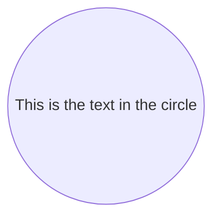
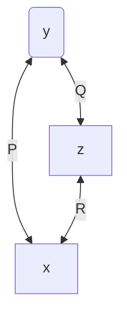
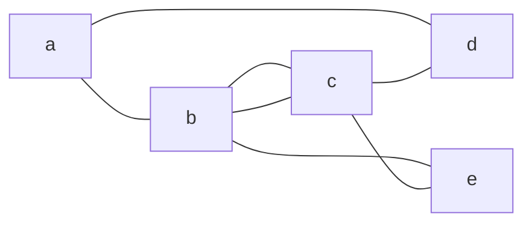
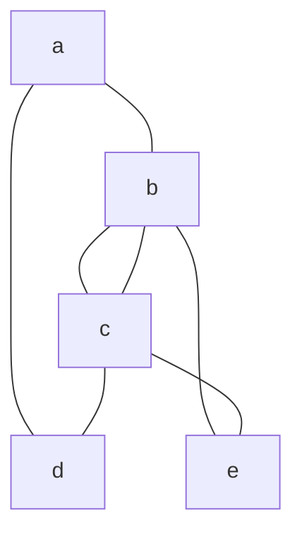
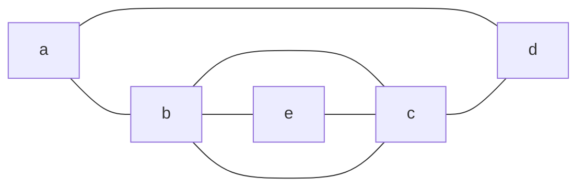
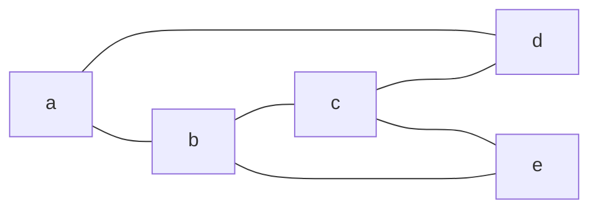
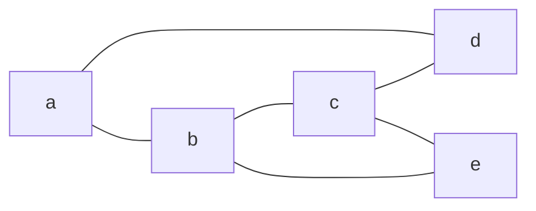

#  mermaid简单流程图
- `mermaid`是一种画流图的方便的工具,使用简单的语法,就可以渲染出相关的流图,对于小型图很友好
- 在markdown中也有所应用


## mermaid_starter使用入门

- 不同图型的语法不同/效果不同
  - 在同一段mermaid代码在图型(A)中是有效且正确的,
  - 但是在图型(B)中可能就是另一种意思,甚至直接导致渲染失败


```c
flowchart LR
    id1((This is the text in the circle))
```




```py
flowchart TB
    y<--P-->x[x]
    y(y)<--Q-->z[z]
    z<--R-->x
```



##  不稳定性
### 引擎版本
 由于引擎版本不同,同样的代码效果可能不同

```csharp
flowchart LR
	a---b & d 
	b---c & e
	c---b 
	c---d
    c---e
```


###  绘制方向(TB/LR)

```csharp
flowchart TB
	a---b & d 
	b---c & e
	c---b 
	c---d
    c---e
```


###  端点调换

```csharp
flowchart LR
	a---b & d 
	b---c & e
	c---b 
	c---d
	e---c
```



##  改善线条
- 拉长边/上下行调换

```csharp
flowchart LR
	a---b & d 
	c----d & e
	b---c & e
```



```csharp
flowchart LR
	a---b & d 
	c---d & e
	b---c & e
```



## 子图

### 例子1

- ```m
  flowchart LR
  subgraph  
      M[主机]
  end
      M<==>IO[I/O接口]<==>dc
  subgraph  IO设备 
      dc[设备控制器]-->机,电,磁,光部件
  end
  ```

  


- ```mermaid
  flowchart LR
  subgraph  
      M[主机]
  end
      M<==>IO[I/O接口]<==>dc
  subgraph  IO设备 
      dc[设备控制器]-->机,电,磁,光部件
  end
  ```

### 例字2

- ```mermaid
    flowchart TD
        A[Start] --> B{Is it?}
        B -->|Yes| C[OK]
        C --> D[Rethink]
        D --> B
        B ---->|No| E[End]
        %%flowchart TB   
        c1-->a2
        subgraph one
        a1-->a2
        end
        subgraph two
        b1-->b2
        end
        subgraph three
        c1-->c2
        end
       
    ```

    - ```m
      flowchart TD
          A[Start] --> B{Is it?}
          B -->|Yes| C[OK]
          C --> D[Rethink]
          D --> B
          B ---->|No| E[End]
          %%flowchart TB   
          c1-->a2
          
          subgraph one
              a1-->a2
          end
      
          subgraph two
              b1-->b2
          end
              subgraph three
              c1-->c2
          end
         
      ```

      

### 例子3

- ```mermaid
    flowchart LR
        c1-->a2
        subgraph one
        a1--->a2
        end
        subgraph two
        b1-->b2
        end
        subgraph three
        c1--->c2
        end
        one---> two
        three--> two
        two--> c2
    
    ```

    - ```m
        flowchart LR
            c1-->a2
            %%子图1
            subgraph one
                a1--->a2
            end
        	%%子图2
            subgraph two
                b1-->b2
            end
        	%%子图3
            subgraph three
                c1--->c2
            end
        	%%组织
        	one---> two
            three--> two
            two--> c2
        
        ```

        

    


# 🎈ref of mermaid

- [mermaid - Markdownish syntax for generating flowcharts, sequence diagrams, class diagrams, gantt charts and git graphs. (mermaid-js.github.io)](https://mermaid-js.github.io/mermaid/#/)
  支持一下类型的图型,各有个的语法

  * [Flowchart](https://mermaid-js.github.io/mermaid/#/flowchart "Flowchart")

  * [Sequence diagram](https://mermaid-js.github.io/mermaid/#/sequenceDiagram "Sequence diagram")

  * [Class Diagram](https://mermaid-js.github.io/mermaid/#/classDiagram "Class Diagram")

  * [State Diagram](https://mermaid-js.github.io/mermaid/#/stateDiagram "State Diagram")

  * [Entity Relationship Diagram](https://mermaid-js.github.io/mermaid/#/entityRelationshipDiagram "Entity Relationship Diagram")

  * [User Journey](https://mermaid-js.github.io/mermaid/#/user-journey "User Journey")

  * [Gantt](https://mermaid-js.github.io/mermaid/#/gantt "Gantt")

  * [Pie Chart](https://mermaid-js.github.io/mermaid/#/pie "Pie Chart")

  * [Requirement Diagram](https://mermaid-js.github.io/mermaid/#/requirementDiagram "Requirement Diagram")

  * [Gitgraph (Git) Diagram 🔥](https://mermaid-js.github.io/mermaid/#/gitgraph "Gitgraph (Git) Diagram 🔥")

  * [Other Examples](https://mermaid-js.github.io/mermaid/#/examples "Other Examples")