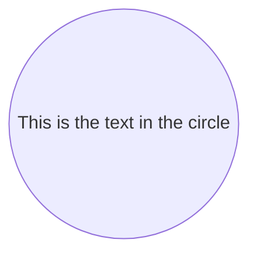
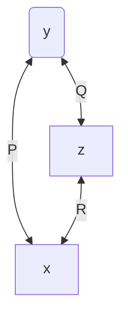

[toc]

## mermaid_starter使用入门

- 不同图型的语法不同/效果不同
  - 在同一段mermaid代码在图型(A)中是有效且正确的,
  - 但是在图型(B)中可能就是另一种意思,甚至直接导致渲染失败


```c
flowchart LR
    id1((This is the text in the circle))
```




```py
flowchart TB
    y<--P-->x[x]
    y(y)<--Q-->z[z]
    z<--R-->x
```




## ref of mermaid

- [mermaid - Markdownish syntax for generating flowcharts, sequence diagrams, class diagrams, gantt charts and git graphs. (mermaid-js.github.io)](https://mermaid-js.github.io/mermaid/#/)
  支持一下类型的图型,各有个的语法

  * [Flowchart](https://mermaid-js.github.io/mermaid/#/flowchart "Flowchart")

  * [Sequence diagram](https://mermaid-js.github.io/mermaid/#/sequenceDiagram "Sequence diagram")

  * [Class Diagram](https://mermaid-js.github.io/mermaid/#/classDiagram "Class Diagram")

  * [State Diagram](https://mermaid-js.github.io/mermaid/#/stateDiagram "State Diagram")

  * [Entity Relationship Diagram](https://mermaid-js.github.io/mermaid/#/entityRelationshipDiagram "Entity Relationship Diagram")

  * [User Journey](https://mermaid-js.github.io/mermaid/#/user-journey "User Journey")

  * [Gantt](https://mermaid-js.github.io/mermaid/#/gantt "Gantt")

  * [Pie Chart](https://mermaid-js.github.io/mermaid/#/pie "Pie Chart")

  * [Requirement Diagram](https://mermaid-js.github.io/mermaid/#/requirementDiagram "Requirement Diagram")

  * [Gitgraph (Git) Diagram 🔥](https://mermaid-js.github.io/mermaid/#/gitgraph "Gitgraph (Git) Diagram 🔥")

  * [Other Examples](https://mermaid-js.github.io/mermaid/#/examples "Other Examples")
