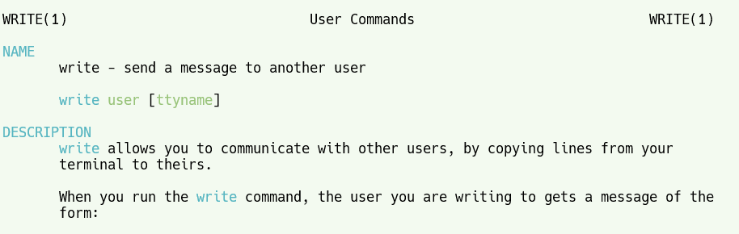

[toc]

# Linux_ Which /Whatis/Whereis

## reference

* [12 Linux Which Command, Whatis Command, Whereis Command Examples (thegeekstuff.com)](https://www.thegeekstuff.com/2013/04/linux-which-whatis-whereis/)

> * This Linux tutorial will explain the three “W” commands. The three “W”s are whatis, whereis and which commands.

## I. Linux whatis Command

* Whatis command is helpful to ` get brief information about Linux commands or functions`.
  * Whatis command displays man page `single line description`for command that `matches string passed as a command line argument to whatis command`.
  * Whatis command searches for string in its index databases which is `maintained by mandb program`.
  * Whatis command picks short description of `NAME section of man page` of command that matches to input given to the whatis command.
* Whatis provides several command line options to help user in getting `brief information of specific Linux commands` as per their need or interest.

Syntax:

```
$ whatis [-options]
```

For example, here is the output of whatis command, when it is run without any option.

```
$ whatis write
write (1)            - send a message to another user
write (2)            - write to a file descriptor
```

It displays brief information about “write” from man pages.



### 1. Get information from specific sections of man pages using -s option

If we want to get Linux command information from specific section of man pages, then we can provide sections list using “-s or —sections or –section” option. It will restrict whatis command to display brief information from specified man page section only.

```
$ whatis -s "1","2" open
open (1)             - start a program on a new virtual terminal (VT).
open (2)             - open and possibly create a file or device
```

It displays open command and function brief information from man page sections 1 and 2.

```
$ whatis -s "2" open
open (2)             - open and possibly create a file or device
```

It displays open function brief information from man page section 2.

### 2. Search information through wild-cards using -w option

If we want to search Linux commands or functions information using wild card, then whatis command gives “-w or –wildcard” option. It will make your search specific as per user’s need.

```
$ whatis -w 'ab*'
abort (3)            - cause abnormal process termination
abs (3)              - compute the absolute value of an integer
```

It displays brief information of Linux commands or functions which start from “ab”.

```
$ whatis -w 'ab?'
abs (3)              - compute the absolute value of an integer
```

It displays brief information of Linux commands or functions which start from “ab” and followed by any single character.

### 3. Search information through regular expressions using -r option

If we want to search Linux commands or functions information using regular expressions, then whatis command gives “-r or –regex” option. It will give flexibility to customize your search for Linux commands or functions throughout the Linux system.

```
$ whatis -r '^ab'
abort (3)            - cause abnormal process termination
abs (3)              - compute the absolute value of an integer
```

It displays brief information of Linux commands or functions which start from “ab”.

```
$ whatis -r 'ab$'
anacrontab (5)       - configuration file for anacron
baobab (1)           - A graphical tool to analyse disk usage
crontab (1)          - maintain crontab files for individual users (Vixie Cron)
crontab (5)          - tables for driving cron
fstab (5)            - static information about the filesystems
inittab (5)          - init daemon configuration
swab (3)             - swap adjacent bytes
tc-stab (8)          - Generic size table manipulations
```

It displays brief information of Linux commands or functions which ends with “ab”.

### 4. Disable trimmed output using -l option

Generally whatis command trims long output of Linux commands or functions information to avoid “Not good” output display on terminal that is going beyond screen. To allow whatis command to show complete output on screen, “-l or –long” option can be used.

```
$ whatis ssh-import-id
ssh-import-id (1)    - retrieve one or more public keys from a public keyserver (Launchpad.net by default) and append them to the current user's authorized_keys file (or some other specifie...
```

It displays trimmed output of brief information of Linux command.

```
$ whatis -l ssh-import-id
ssh-import-id (1)    - retrieve one or more public keys from a public keyserver (Launchpad.net by default) and append them to the current user's authorized_keys file (or some other specified file)
```

It displays complete output of brief information of Linux command.

### 5. Restrict search up to specified path using -M option

By default, whatis command uses $MANPATH environment variable. But whatis provides “-M or –manpath” option to restrict search up to specified path of man pages.

```
$ whatis -M /usr/share/man hexdump
hexdump (1)          - ASCII, decimal, hexadecimal, octal dump
```

It displays brief information of Linux hexdump command from man pages available at path /usr/share/man.

```
$ whatis -M /usr/man hexdump
hexdump: nothing appropriate.
```

It could not find brief information of Linux hexdump command from specified path /usr/man.

## II. Linux whereis Command

* `Whereis` command is helpful to [locate](https://www.thegeekstuff.com/2012/03/locate-command-examples/)
  * binary,
  * source,
  * `manual pages of commands` in the Linux system.
* It is very simple utility and provides several options which are given below with examples.

Syntax:

```
$ whereis [-options]
```

For example, whereis command is run without any option.

```
$ whereis open
open: /bin/open /usr/share/man/man1/open.1.gz /usr/share/man/man2/open.2.gz
```

* It locates
  * `binary`,
  * `source and man pages of “open” command` and
  * `paths` (where (binary, man pages of open command) is available) in the system.

### 6. Locate binaries using -b option

If we want to locate binary of Linux command, use “-b” option.

```
$ whereis -b whereis
whereis: /usr/bin/whereis /usr/bin/X11/whereis
```

It locates binary of “whereis” command and displays paths where binary of command is available in the system.

### 7. Locate man pages for a command using -m option

If we want to locate man page of Linux command, use “-m” option.

```
$ whereis -m whereis
whereis: /usr/share/man/man1/whereis.1.gz
```

It locates man page of “whereis” command and displays path where man page of command is available in the system.

### 8. Locate source of a command using -s option

If we want to locate source of Linux command, use “-s” option.

```
$ whereis -s whereis
whereis:
```

It locates source of “whereis” command, but source of “whereis” command does not exist in the system, so it did not display path for source of command in the system.

### 9. Locate unusual entries using -u option

This option is something different that searches for unusual entries. These entries are those command whose source, binary or man page does not exist in the system as per options “[-bms]” specified along with “–u”.

```
$ whereis  -m  -u wcgrep
wcgrep:
```

It checks if specified command (i.e. wcgrep) man page does not exist in the system. Whereis command with options “-m and -u” locates for the commands in the system whose man page does not exist.

```
$ whereis  -m  -u grep
$
```

Here, whereis command with same options is applied on “grep” command whose man page exists in the system, so whereis returned nothing and exits normally.

### 10. Locate binaries in a specified path using -B option

If user wants to search for binary and wants to limit the scope of search for whereis command up to specified path, then use “-B” option.

```
$ whereis -B /bin -f for_loop
for_loop: /bin/for_loop
```

It locates binary of “for_loop” user program from path “/bin”.

```
$ whereis -B /usr -f open
open: /usr/share/man/man1/open.1.gz /usr/share/man/man2/open.2.gz
```

If open command’s binary is not found at specified path, then it is not shown but whereis command by default searches for other types (i.e. man page and source) of specified command (i.e. open) and displays them if found.

### 11. Locate man pages with limited scope using -M option

If user wants to search for man pages and wants to limit the scope of search for whereis command up to specified path, then use “-M” option.

```
$ whereis -M /usr/share/man/man1 -f open
open: /bin/open /usr/share/man/man1/open.1.gz
$ whereis -M /usr/share/man/man2 -f open
open: /bin/open /usr/share/man/man2/open.2.gz
$ whereis -M /usr/share/man/man3 -f open
open: /bin/open
```

Here, it is observed that whereis command is displaying man page of “open” command which is available in specified path only. But, whereis command by default searches for other types (i.e. binary and source) of specified command (i.e. open) and displays them if found.

## III. Linux which Command

* `Which` command is very small and simple command to locate `executables `in the system.
  * It allows user to pass `several command names as arguments` to get `their paths in the system`.
  * “which” commands searches the path of executable in `system paths` set in $PATH [environment variable](https://www.thegeekstuff.com/2012/07/linux-export-command-examples/).

Syntax:

```
$ which [-option]
```

For example,

```
$ which ls gdb open grep
/bin/ls
/usr/bin/gdb
/bin/open
/bin/grep
```

It locates command names – “ls”, “gdb”, “open” and “grep” specified as arguments to “which” command and displays paths of each executable where it exists in the system.

### 12. Display all the paths using -a option

“which” command gives option “-a” that displays all paths of executable matching to argument.

```
$ which echo
/usr/sbin/echo
```
> 默认情况下,只返回第一个找到的结果,如果要返回找到的所有结果,使用`-a`选项

* Above will search display the executable “echo” from all paths set in `$PATH` environment variable and displays the first path where echo executable is found.
*  It may be case that executable is placed at other paths of $PATH environment variable as well. 
*  To get all paths where executable is present in the system, “-a” option can be used.

```
$ which -a  echo
/usr/sbin/echo
/bin/echo
```
