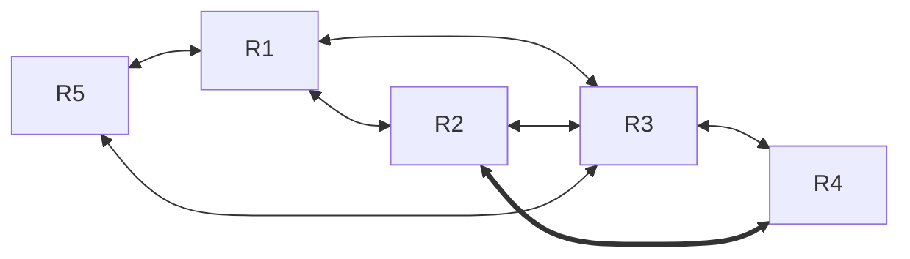

@[toc]

# 层次路由

- 当网络规模扩大时，**路由器的路由表成比例地增大**.
- 这不仅会消耗越来越多的**路由器缓冲区空间**，而且需要用更多**CPU时间**来扫描路由表，**占用更多的带宽来交换**路由状态信息.
- 因此路由选择必须按照层次的方式进行.
- 因特网将整个互联网划分为许多较小的自治系统（注意一个自治系统中包含很多局域网），
  - 每个自治系统有权自主地决定本系统内应采用何种路由选择协议.
  - 如果两个自治系统需要通信，那么就需要一种在**两个自治系统之间的协议**来屏蔽这些差异.
- 据此，因特网把**路由选择协议划分为两大类**：
  - 1)一个自治系统内部所使用的路由选择协议称为内部网关协议(IGP),也称域内路由选择，具体的协议有RIP和OSPF等.
  - 2)自治系统之间所使用的路由选择协议称为外部网关协议(EGP),也称域间路由选择，
    - 用在不同自治系统的路由器之间交换路由信息，并负责为分组在不同自治系统之间选择最优的路径.具体的协议有BGP.
    - 使用层次路由时，OSPF将一个自治系统再划分为若干区域(Area),每个路由器都知道在本区域内如何把分组路由到目的地的细节，但不用知道其他区域的内部结构.
    - 采用分层次划分区域的方法虽然会使交换信息的种类增多，也会使OSPF协议更加复杂;但这样做却能使每个区域内部交换路由信息的通信量大大减小，因而使OSPF协议能够用于规模很大的自治系统中.


##  动态路由算法

- 动态路由算法以**目的网络**为导向,借助**下一跳路由**来实现相关算法.
- 主要包括RIP和OSPF

##  距离向量算法(RIP)

- [Routing Information Protocol - Wikipedia](https://en.wikipedia.org/wiki/Routing_Information_Protocol)
- 属于应用层协议🎈
  - 虽然在网络从介绍它,但从它的报文格式看,是应用层协议
  - 通过传输层的UDP协议来封装RIP报文
- RIP (Routing Information Protocol)是内部网关协议 IGP 中最先得到广泛使用的协议[RFC 1058]，它的中文名称叫做路由信息协议，但很少被使用。
- RIP 是一种分布式的基于距离向量的路由选择协议，是互联网的标准协议，其最大优点就是简单。 
- RIP 协议要求网络中的每一个路由器都要维护从它自己到其他每一个目的网络的距离记录（因此，这是一组距离，即“距离向量”）。

### RIP 协议将“距离”定义

- 从一路由器到**直接连接的网络的距离定义为 1**。
- 从一路由器到**非直接连接**的网络的距离定义为所**经过的路由器数加 1**。
- “加 1”是因为到达目的网络后就进行**直接交付**，而到直接连接的网络的距离已经定义为 1
- 需要注意的是，到<u>直接连接的网络</u>的距离也可定义为 0
  - 采用这种定义的理由是：路由器在和直接连接在该网络上的主机通信时，不需要经过另外的路由器。
  - 既然每经过一个路由器要将距离加 1，那么不再经过路由器的距离就应当为 0
  - 但两种不同的定义对实现 RIP 协议并无影响，因为**重要的是要找出最短距离**，将所有的距离都加 1 或都减 1，对选择最佳路由**其实是一样的**。 
  - 两种定义不影响RIP算法的正确性(不应该混用1和0,选定其中一种定义后就坚持到底)
  
- RIP 协议的“距离”也称为“跳数”(hop count)，
  - 因为每经过一个路由器，跳数就加1。
  - RIP 认为好的路由就是它通过的路由器的数目少，即“距离短”。
  - RIP 允许一条路径最多只能包含 15 个路由器。
  - 因此“距离”等于 16 时即相当于不可达。
  - 可见 RIP 只适用于小型互联网。 
- RIP 不能在两个网络之间同时使用多条路由。
  - RIP 选择一条具有最少路由器的路由（即最短路由），哪怕还存在另一条高速(低时延)但路由器较多的路由。 
-  RIP 协议和 OSPF 协议，都是分布式路由选择协议。
  - 它们的共同特点就是每一个路由器都要不断地和其他一些路由器交换路由信息。
  - 我们一定要弄清以下三个要点，即和哪些路由器交换信息？交换什么信息？在什么时候交换信息？ 

### RIP 协议的特点是： 

- (1) 仅和**相邻路由器**交换信息。
  - 如果两个路由器之间的通信不需要经过另一个路由器，那么这两个路由器就是相邻的。RIP 协议规定，不相邻的路由器不交换信息。 

- (2) 路由器交换的信息是**当前本路由器所知道的全部信息**，即自己现在的路由表。
  - 也就是说，交换的信息是：“我到本自治系统中所有网络的（最短）距离，以及到每个网络应经过的下一跳路由器”。 

- (3) 按**固定的时间间隔**交换路由信息，
  - 例如，每隔 30 秒。
  - 然后路由器根据收到的路由信息更新路由表。
  - 当网络拓扑发生变化时，路由器也及时向相邻路由器通告拓扑变化后的路由信息。 
  - 路由器在刚刚开始工作时，它的路由表是空的。
  - 然后路由器就得出到直接相连的几个网络的距离（这些距离定义为 1）。
  - 接着，每一个路由器也只和数目非常有限的相邻路由器交换并更新路由信息。
  - 但经过若干次的更新后，<u>所有的路由器最终都会知道到达本自治系统中任何一个网络的最短距离和下一跳路由器的地址。</u> 
  - 看起来 RIP 协议有些奇怪，因为“我的路由表中的信息要依赖于你的，而你的信息又依赖于我的。
  - ”然而事实证明，通过这样的方式—“我告诉别人一些信息，而别人又告诉我一些信息。我再把我知道的更新后的信息告诉别人，别人也这样把更新后的信息再告诉我”，最后在自治系统中所有的结点都得到了正确的路由选择信息。 
  - **路由表中最主要的信息**就是：
    - 到某个网络的距离（即最短距离），以及应经过的下一跳地址。
  - 路由表更新的原则是找出到每个目的网络的**最短距离**。
  - 这种更新算法又称为距离向量算法。 

  - 在一般情况下，RIP 协议可以收敛，并且过程也较快。

### 收敛

- 收敛，是指当路由环境发生变化后，各路由器调整自己的路由表以适应网络拓扑结构的变化，最终达到稳定状态（路由表与网络拓扑状态保持一致）;在自治系统中所有的结点都得到正确的路由选择信息的过程。
- 收敛越快，路由器就能越快适应网络拓扑结构的变化。


### RIP路由表格式

- | 目的网络 | 距离(跳数/延迟) | 下一条路由(NextRouter) |
  | -------- | --------------- | ---------------------- |

- 下一跳地址是IP地址,而不是物理地址(MAC地址)

- 路由选择协议不负责确定物理地址

### 直连网络&直接交付@间接交付

- 路由选择分为直接交付和间接交付
- 当发送站与目的站在**同一网段**内时，就使用直接交付，反之使用间接交付，
- 间接交付的**最后一个路由器肯定直接交付**
- 直接交付在同一网段内，因此不涉及路由器 

-  本路由器可以直接完成转任务,而不需要第二个路由器参时也可能是间接交付

  - 因为同一个路由器可以链接两个网段,如果发生跨网段,就是间接交付

  - 不跨网段才是直接交付
  
  - ```mermaid
    flowchart LR
    	Net1<-->R<-->Net2<-.->C3 & C4
    	Net1<-.->C1[[C1]] & C2[[C2]]
    	
    ```

  - 例如:Net1和Net2中的主机交换信息,就属于间接交付
  
    - 例如,Net1中有计算机C1想要发送数据到Net2中的C4
  
  - 如果是C1想要发送数据到C2,它们不需要经过路由器可以通信(处于同一网段)
  


### RIP算法

-  




- 路由器收到相邻路由器（其地址为）的一个RIP报文：

- (1)先修改此RIP报文中的**所有项目**：
  - 把“下一跳”字段中的地址都改为X,
  - 并把所有的“距离”字段的值加1.
- (2)对修改后的RIP报文中的**每一个项目**，重复以下步骤：
  - 若项目中的**目的网络D不在路由表**中，则把该项目加到路由表中.
  - 否则(路由表中存在目的网络值为D的相关表项,只需要**更新表项**)
    - 若**下一跳字段**给出的**路由器地址**是**同样**的，则**把收到的项目替换原路由表中的项目**
      - 这种情况下距离字段可能发生变化;
        - 可能变大,也可能变小(更新原因是表项的内容可能是过时而不准确的,纯粹是为了获得最新信息)
    - 否则,下一跳路由地址是不同的
      - 这表示不同于现在路由表中所知道的路径是不同的(通往D新的路径出现了)
      - 但是新的路径未必比旧的路径更优(更短)因此还需要比较一下,再决定是使用新路径还是保留旧路径而放弃新路径
      - 若收到项目中的距离小于路由表中的距离，则进行更新，
        - 否则，什么也不做.
- (3)若3分钟还没有收到相邻路由器的更新路由表，则把此相邻路由器记为不可达路由器，即将距离置为16（表示不可达）.
- (4)返回.

### 坏消息传得慢

- $$
  \def\lr#1#2{{#1}\leftrightarrow{#2}}
  \\\lr{\xcancel{{Net_1}}}{R1}\lr{}{\boxed {Net_2}}\lr{}{R2}\lr{}{\boxed{Net_3}}
  $$

- 假设路由R1到达网1的链路出现故障,R1无法到达网络1

- 于是路由器R1把到达网络1的距离改为16(表示网络1不可达)

- R1中的路由表中相应项目应该为(1,16,直连)

  - 结构为:

  - 目的网络(的代表IP)

  - 跳数

  - 下一条地址

- 但是很可能需过了30秒后,R1才把更新信息发送给R2;

  - 且R2可能已经先把自己的路由表发送给了R1,其中有条目(1,2,R1)

  - R1收到R2的更新报文后,误认为可以经过R2到达网1,于是将收到的路由信息更新了自己的条目
    - 根据RIP协议的算法计算过渡条目U=(1,3,R2),

    - R1中的(1,16,直连)被改为U=(1,3,R2)

  - 接着R1可能将此时的路由表发送给R2,
    - R2中的(1,2,R1)将被改为U=(1,4,R1)

  - 类似的过程,R2可能将此时的路由表发送给R1
    - R1中的(1,3,R2)被修改为U=(1,5,R2)

  - 不断重复
    - ...
    - R2中(1,14,R1)被修改为U=(1,15,R1)
    - R1中(1,15,R2)被修改为U=(1,16,R1)(不可达)
    - R2中(1,15,R1)被修改为U=(1,16,R2)(不可达)

  - 终于R1,R2都得到了正确的信息()

  


#### 特点

- 距离向量算法的基础就是 Bellman-Ford 算法（或 Ford-Fulkerson 算法）。
- 这种算法的要点是这样的： 
- 设 X 是结点 A 到 B 的最短路径上的一个结点。
- 若把路径 A→B 拆成两段路径 A→X 和X→B，则每一段路径 A→X 和 X→B 也都分别是结点 A 到 X 和结点 X 到 B 的最短路径
- **好消息传播得快，而坏消息传播得慢**。
- 网络出故障的传播时间往往需要较长的时间(例如数分钟)。这是 RIP 的一个主要缺点。 
- 但如果一个路由器发现了更短的路由，那么这种更新信息就传播得很快。 
  - 为了使坏消息传播得更快些，可以采取多种措施。
  - 例如，让路由器记录收到某特定路由信息的接口，而不让同一路由信息再通过此接口向反方向传送。

- RIP 协议最大的优点就是实现简单，开销较小。
- 但 RIP 协议的缺点也较多。
  - 首先，RIP 限制了网络的规模，它能使用的最大距离为 15（16 表示不可达）。
  - 其次，路由器之间交换的路由信息是路由器中的完整路由表，因而随着网络规模的扩大，开销也就增加。
  - 最后，“坏消息传播得慢”，使更新过程的收敛时间过长。(慢收敛容易造成路由回路问题)


###  实例


- R6路由表

  - | 目的网络 | 距离(跳数) | 下一跳路由 |
    | -------- | ---------- | ---------- |
    | Net2     | 3          | R4         |
    | Net3     | 4          | R5         |
    | ...      | ...        | ...        |

- R4发来的路由更新信息:(也就是R4的路由表)

  - | 目的网络 | 距离(跳数) | 目的网络 |
    | -------- | ---------- | -------- |
    | Net1     | 3          | R1       |
    | Net2     | 4          | R2       |
    | Net3     | 1          | 直接交付 |
    | ...      | ...        | ...      |

  - R6收到更新信息,开始计算R4路由表的过度表格U(R4)

    - 将R4映射成U(R4):(拷贝一份R4)其执行以下操作

      - 将下一跳路由全部改为R4
      - 将跳数全部加1

    - 这个操作的意图是,使得路径:$R6\to{R4}\to{Rx}$的距离可以从U(R4)的距离字段直接看出来

    - | *(条目编号)* | 目的网络 | 距离(跳数) | 下一跳路由 |
      | ------------ | -------- | ---------- | ---------- |
      | 1            | Net1     | 4          | R4         |
      | 2            | Net2     | 5          | R4         |
      | 3            | Net3     | 2          | R4         |
      | ...          | ...      | ...        | ...        |

      - 条目编号不是路由表中的字段,为了便于指代和讨论所设立

- R6对比U(R4),增加/更新R6中的项目

  - | 目的网络 | 距离(跳数) | 下一跳路由 | Note                                                         |
    | -------- | ---------- | ---------- | ------------------------------------------------------------ |
    | Net1     | 4          | R4         | 这个表项是新增的                                             |
    | Net2     | 5          | R4         | 目的网络一致,由于下一跳路由都是R4,**强制更新**为U(R4)中的值  |
    | Net3     | 2          | R4         | 对比U(R4)条目3,目的网络一致,<br />下一跳路由不同,则需要比较距离;<br />U(R4)中的值更优(2<4),更新为2 |
    | ...      | ...        | ...        | ...                                                          |


### 例

- 考虑如右图所示的子网，

  - ```mermaid
    flowchart LR
    	A<-->B<-->C<-->D<-->F<-->E<-->A
    	B<-->F
    	C<==>E
    ```

    

  

- 该子网使用了距离向量算法，下面的向量刚刚到达路由器C:

  - 来自B的向量为（5,0,8,12,6,2)；
  - 来自D的向量为(16,12,6,0,9,10)；
  - 来自E的向量为(7,6,3,9,0,4)。

- 经过测量，C到B、D和E的延迟分别为6、3和5

- 那么C到达所有结，点的最短路径是（B）。

  - A.(5,6,0,9,6,2)
    B.(11,6,0,3,5,8)
    C.(5,11,0,12,8,9)
    D.(11,8,0,7,4,9)

- 分析:

  - $x\in\{A,B,C,D,E,F\}$

- 🎈本例中,将直接交付定义为`延迟0`

- |                 |                 | A      | B     | C    | D     | E     | F     |
  | --------------- | ------ | ----- | ---- | ----- | ----- | ----- | ----- |
  | $B\to{x}$       |        | 5      | 0     | 8    | 12    | 6     | 2     |
  | $D\to{x}$       |        | 16     | 12    | 6    | 0     | 9     | 10    |
  | $E\to{x}$       |        | 7      | 6     | 3    | 9     | 0     | 4     |
  | $C\to{B}\to{x}$ | +6 | **11** | **6** | 14   | 18    | 12    | **8** |
  | $C\to{D}\to{x}$ | +3 | 19     | 15    | 9    | **3** | 12    | 13    |
  | $C\to{E}\to{x}$ | +5 | 12     | 11    | 8    | 14    | **5** | 9     |
  |                 |                 |        | B     |      | D     | E     |       |

- 向量中的各个分量对应的站点应该是从A到F或者其逆向顺序

  - 观察向量中为0的分量,表示到自身,所以可以直接确定B是第2个分量
  - (D,E也是,分别为第4,5个分量)

- 容易看到,C到其他站点的最短距离分别是

  - A:11
  - B:6
  - C:0(目的网络连接在C上,是可以直接交付直连网路,延迟为0,而不会是其他值)
  - D:3
  - E:5
  - F:8

## OSPF协议

[Open Shortest Path First - Wikipedia](https://en.wikipedia.org/wiki/Open_Shortest_Path_First)

- **开放式最短路径优先**（英语：Open Shortest Path First，缩写为 OSPF）是广泛使用的一种路由协议，它属于链路状态路由协议，具有路由变化收敛速度快、无路由环路、支持变长子网掩码（VLSM）和汇总、层次区域划分等优点。

- OSPF是一种基于[IP协议](https://zh.wikipedia.org/wiki/IP协议)的[路由协议](https://zh.wikipedia.org/wiki/路由协议)。它是大中型网络上使用较为广泛的[IGP](https://zh.wikipedia.org/wiki/内部网关协议)协议。

- OSPF是对[链路状态路由协议](https://zh.wikipedia.org/w/index.php?title=链路状态路由协议&action=edit&redlink=1)的一种实现，运作于[自治系统](https://zh.wikipedia.org/wiki/自治系统)内部。

- OSPF分为OSPFv2和OSPFv3两个版本：

  - OSPFv2定义于[RFC 2328](https://tools.ietf.org/html/rfc2328)（1998），支持[IPv4](https://zh.wikipedia.org/wiki/IPv4)网络；
  - 而OSPFv3定义于[RFC 5340](https://tools.ietf.org/html/rfc5340)（2008），支持[IPv6](https://zh.wikipedia.org/wiki/IPv6)网络。

- 它采用[戴克斯特拉算法](https://zh.wikipedia.org/wiki/戴克斯特拉算法)来计算[最短路径树](https://zh.wikipedia.org/wiki/最短路径树)。

  - 它使用“代价（Cost）”作为路由度量。
  - 链路状态数据库（LSDB）用来保存当前[网络拓扑](https://zh.wikipedia.org/wiki/网络拓扑)结构，[路由器](https://zh.wikipedia.org/wiki/路由器)上属于**同一区域的链路状态数据库**是**相同的**（属于多个区域的路由器会为每个区域维护一份链路状态数据库）。

- OSPF提出了“区域（Area）”的概念，一个网络可以由单一区域或者多个区域组成。

  - 其中，一个特别的区域被称为**骨干区域（Backbone Area）**，该区域是整个OSPF网络的核心区域，并且所有其他的区域**都与之直接连接**。

  - 所有的**内部路由都通过骨干区域传递到其他非骨干区域**。

  - 所有的区域都必须直接连接到骨干区域，如果不能创建直接连接，那么可以通过[虚链路](https://zh.wikipedia.org/w/index.php?title=虚链路&action=edit&redlink=1)（virtual link）和骨干区域创建[虚拟连接](https://zh.wikipedia.org/w/index.php?title=虚拟连接&action=edit&redlink=1)。

  - 

  - 

    

- 同一个[广播域](https://zh.wikipedia.org/wiki/广播域)（Broadcast Domain）的[路由器](https://zh.wikipedia.org/wiki/路由器)或者一个[点对点](https://zh.wikipedia.org/wiki/点对点)（Point To Point）连接的两端的路由器，在发现彼此的时候，创建邻接（Adjacencies)

- 多路访问网络以及非广播多路访问网络的路由器会选举**指定路由器（Designated Router, DR）**和**备份指定路由器（Backup Designated Router, BDR）**，DR和BDR作为**网络的中心**负责路由器之间的信息交换从而降低了网络中的信息流量。

- OSPF协议同时使用[单播](https://zh.wikipedia.org/wiki/單播)（Unicast）和[组播](https://zh.wikipedia.org/wiki/組播)（Multicast）来发送[Hello包](https://zh.wikipedia.org/w/index.php?title=Hello包&action=edit&redlink=1)和链路状态更新（Link State Updates），使用的组播[地址](https://zh.wikipedia.org/wiki/IP地址)为224.0.0.5和224.0.0.6。

### OSPF协议的基本特点

- 开放最短路径优先（OSPF:Open Shortest Path First)）协议是使用**分布式链路状态路由算法**的典型代表，也是内部网关协议(IGP）的一种.
- 基础是Dijkstra算法
- 开放最短路径优先(OSPF)协议是使用分布式链路状态路由算法的典型代表，也是内部网关协议(IGP)的一种。

### 链路状态

- “链路状态”说明本路由器**和哪些路由器相邻**及该链路的“度量”（或代价）。
- 一个路由器的链路状态**只涉及**与**相邻路由器**的连通状态

### OSPF和RIP的区别🎈

- OSPF与RIP相比有以下4点主要区别：
- 1)OSPF向本自治系统中的所有路由器发送信息，这里使用的方法是洪泛法。
  - 而RIP仅向自己相邻的几个路由器发送信息。

- 2)发送的信息是与本路由器相邻的所有路由器的**链路状态**，但这只是路由器所知道的部分信息。
  - 而在IP中，发送的信息是本路由器所知道的全部信息，即整个路由表。
- 3)只有当链路状态发生变化时，路由器才用洪泛法向所有路由器发送此信息，并且更新过程收敛得快，不会出现RIP“坏消息传得慢”的问题。
  - 而在RIP中，不管网络拓扑是否发生变化，路由器之间都会定期交换路由表的信息。
- 4)OSPF是**网络层协议**，它不使用UDP或TCP,而**直接用IP数据报传送**（其IP数据报首部的协议字段为89)。
  - 而RIP是**应用层协议**，它在**传输层使用UDP**
- 5)拓扑结构
  - RIP的路由不知道全网的拓扑结构
  - OSPF的路由都知道全网自己所在区域的拓扑结构

### OSPF其他特点

- 1)OSPF对不同的链路可根据**IP分组的不同服务类型(TOS)**而设置成不同的代价。
  - 因此，OSPF对于不同类型的业务可计算出不同的路由，十分灵活。

- 2)如果到同一个目的网络有多条相同代价的路径，那么可以将通信量分配给这几条路径。
  - 这称为多路径间的**负载平衡**。

- 3)所有在OSPF路由器之间交换的分组都具有**鉴别功能**，因而保证了<u>仅在可信赖的路由器之间交换链路状态信息。</u>
- 4)支持可变长度的子网划分和无分类编址CIDR.
- 5)每个链路状态都带上一个32位的序号，序号越大，状态就越新。

### OSPF的基本工作原理

- 由于各路由器之间频繁地交换链路状态信息，因此**所有路由器最终都能建立一个链路状态数据库**。
  - 这个数据库实际上就是全网的拓扑结构图，它在全网范围内是一致的（称为链路状态数据库的同步）。
- 然后，**每个路由器根据这个全网拓扑结构图**，使用Dijkstra最短路径算法计算从自己到各目的网络的最优路径，以此**构造自己的路由表**。
  - 此后，当链路状态发生变化时，每个路由器重新计算到各目的网络的最优路径，构造新的路由表。

#### 区域

- 虽然使用Dijkstr算法能计算出完整的最优路径，但**路由表中不会存储完整路径**，而只存储“下一跳”(只有到了下一跳路由器，才能知道再下一跳应当怎样走)

- 为使OSPF能够用于规模很大的网络，OSPF将一个自治系统再**划分为若干更小的范围，称为区域**。
- 划分区域的好处是，将利用<u>洪泛法交换链路状态信息的范围局限于每个区域而非整个自治系统</u>，减少了整个网络上的通信量。

- 在一个**区域内部的路由器只知道本区域的完整网络拓扑**，而不知道其他区域的网络拓扑情况。
- 这些区域也有层次之分。
- **处在上层的域称为主干区域**，负责连通其他下层的区域，并且还连接其他自治域。
- 采用分层划分区域的方法是的交换信息的种类增多,是OSPF协议更加复杂

### OSPF路由器类型  


- OSPF定义了以下4种[路由器](https://zh.wikipedia.org/wiki/路由器)类型：

  - 内部路由器（Internal Router）

  - 骨干路由器（Backbone Router）

  - 区域边界路由器（Area Border Router，ABR）

  - [自治系统](https://zh.wikipedia.org/wiki/自治系统)边界路由器（Autonomous System Boundary Router，ASBR）

#### 内部路由器 

如果一台路由器上所有启用了OSPF的接口都在同一区域，那么这台路由器就是内部路由器。

#### 骨干路由器

- 骨干路由器是指**至少有一个启用了OSPF的接口是和骨干区域（Area 0）相连的**路由器。
- 一台骨干路由器也可以同时是ABR或ASBR 

#### 区域边界路由器

- 区域边界路由器是指连接一个或者多个区域的路由器。
- 区域边界路由器为每一个与之相连的区域维护一份链路状态数据库，因此**区域边界路由器需要比内部路由器更多的内存资源和更高性能的[处理器](https://zh.wikipedia.org/wiki/处理器)。**

#### 自治系统边界路由器

自治系统边界路由器（ASBR）用来把从其他路由协议（如[BGP](https://zh.wikipedia.org/wiki/BGP)、[EIGRP](https://zh.wikipedia.org/wiki/EIGRP)、[其他进程号的OSPF](https://zh.wikipedia.org/w/index.php?title=其他进程号的OSPF&action=edit&redlink=1)等）学习到的路由以[路由重分发](https://zh.wikipedia.org/w/index.php?title=路由重分发&action=edit&redlink=1)的方式注入到OSPF进程中，从而使得整个OSPF域内的路由器都可以学习到这些路由（除了末梢区域内的路由器）。一台ASBR可以是OSPF域内非末梢区域的任何路由器，它可以是内部路由器、区域边界路由器、骨干路由器。

- 
  - R2既是骨干路由器BR，也同时是区域边界路由器ABR和自治系统边界路由器ASBR
    - R2和R5之间运行了BGP，并且R2将BGP路由重分发进OSPF
    - 一台路由器可以同时属于多种类型，R2同时属于多种类型路由器
  - R3是一台区域边界路由器ABR,也是骨干路由器BR
  - R1和R4是内部路由器IR。

- 每一台OSPF路由器都有一个路由器标识符（Identifier），一般写作路由器ID。
- 路由器ID由一个长度为32 bits的字段所定义，通常用IPv4地址格式来表示（如1.2.2.2）
  - 如果没有显式的设置路由器ID，则该路由器上最大的活跃[逻辑](https://zh.wikipedia.org/wiki/逻辑)接口IP地址将成为路由器ID；
  - 如果路由器不存在逻辑接口，则最大的活跃物理接口IP地址将成为路由器ID。
  - 不要将路由器类型和指定路由器（Designated Router，DR）、备份指定路由器（Backup Designated Router，BDR）混淆，**DR和BDR是路由器接口属性，而不是整个路由器的属性**。

-  OSPF协议将一个自治域划分成若干域，有一种特殊的域称为主千区域 域之间通过区城边界路由器互联
- 主干区域中，用于连接主干区域和其他下层区域的路由器称为**区域边界路由器**。
- 只要是在主干区域中的路由器，就都称为主干路由器，因此**主干路由器可以兼作区域边界路由器**。

## OSPF与 RIP主要区别:

-  路由器间交换消息的方式
   -  1)OSPF向本自治系统中的所有路由器发送信息，这里使用的方法是洪泛法.而RIP仅向自己相邻的几个路由器发送信息.

-  路由器间交换的消息区别
  -  2）发送的信息是与本路由器相邻的所有路由器的链路状态，但这只是路由器所知道的部分信息.“链路状态”说明本路由器和哪些路由器相邻及该链路的“度量”(或代价).而在RIP中，发送的信息是本路由器所知道的全部信息，即整个路由表.
-  路由表变化频率
  -  3）只有当链路状态发生变化时，路由器才用洪泛法向所有路由器发送此信息，并且更新过程收敛得快，不会出现REP“坏消息传得慢”的问题.
    而在 RIP中，不管网络拓扑是否发生变化，路由器之间都会定期交换路由表的信息.
-  两种协议所处的层次
  -  4)OSPF是网络层协议，它不使用UDP或TCP，而直接用P数据报传送（其P数据报首部的协议字段为89).
    而RIP是应用层协议，它在传输层使用UDP.

### OSPF的五种分组(Protocol messages)

- ```mermaid
  flowchart LR
  	问候-->描述-->请求-->更新-->确认
  ```

  

- ```mermaid
  flowchart LR
  	问候(hellow)-->描述(description)-->请求(Requset)-->更新(Update)-->确认(Acknowledge)
  ```

  

- 1)问候分组(Hello)，用来发现和维持邻站的**可达性**。
- 2)数据库描述分组，向邻站给出**自己的**链路状态数据库中的**所有链路状态项目的摘要信息**。
- 3)链路状态请求分组，向对方请求发送某些链路状态项目的详细信息。
- 4)链路状态更新分组，用**洪泛法对全网更新链路状态**。
- 5)链路状态确认分组，对链路更新分组的确认。
- Unlike other routing protocols, OSPF does not carry data via a transport protocol, such as the [User Datagram Protocol](https://en.wikipedia.org/wiki/User_Datagram_Protocol) (UDP) or the [Transmission Control Protocol](https://en.wikipedia.org/wiki/Transmission_Control_Protocol) (TCP). 
- Instead, OSPF forms IP datagrams directly, packaging them using protocol number 89 for the [IP Protocol field](https://en.wikipedia.org/wiki/List_of_IP_protocol_numbers).
-  OSPF defines five different message types, for various types of communication. 
- Multiple packets can be sent per frame.
- OSPF uses the following packets 5 type:

  - Hello
  - Database description
  - Link State Request
  - Link State Update
  - Link State Acknowledgement

#### 路由器交流过程

- 通常每隔10秒，每两个相邻路由器要**交换**一次**问候分组**，以便知道哪些站可达。
- 在路由器刚开始工作时，OSPF让每个路由器使用**数据库描述分组**和相邻路由器交换本数据库中已有的链路状态摘要信息。
- 然后，路由器使用**链路状态请求分组**，向**对方请求发送自己所缺少的某些链路状态项目的详细信息**。
- 经过一系列的这种分组交换，就建立了全网同步的链路数据库
- 在网络运行的过程中，只要一个路由器的链路状态发生变化，该路由器就要使用**链路状态更新分组**，用洪泛法**向全网更新链路状态**。
- 其他路由器在更新后，发送**链路状态确认分组**<u>对更新分组进行确认</u>
- 为了确保链路状态数据库与全网的状态保持一致，OSPF还规定每隔一段时间(如30分钟)就刷新一次数据库中的链路状态。
- 由于一个路由器的链路状态只涉及与相邻路由器的连通状态，因而**与整个互联网的规模并无直接关系**。
  - 因此，当互联网规模很大时，OSPF要比RIP好得多，而且OSPF协议没有“坏消息传播得慢”的问题。

## BGP

- 边界网关协议(Border Gateway Protocol,,BGP)是不同自治系统的路由器之间交换路由信息的协议，是一种外部网关协议。
- 边界网关协议常用于互联网的网关之间。
- 内部网关协议主要设法使数据报在一个AS中尽可能有效地从源站传送到目的站。
- 在一个AS内部不需要考虑其他方面的策略。
- 然而BGP使用的环境却不同，主要原因如下：
  - 因特网的规模太大，使得自治系统之间路由选择非常困难。
  - 对于自治系统之间的路由选择，要寻找最佳路由是很不现实的。
  - 自治系统之间的路由选择必须考忠有关策略。
  - 边界网关协议(BGP)<u>只能力求寻找一条能够到达目的网络且比较好的路由（不能兜圈子）</u>，而并非寻找一条最佳路由。
  - BGP采用的是**路径向量路由选择协议**，它与<u>距离向量协议和链路状态协议有很大的区别</u>。
  - BGP是**应用层协议**，它是基于TCP的。

### BGP的工作原理如下：

- 每个自治系统的管理员要选择至少一个路由器（可以有多个）作为该自治系统的“BGP发言人”。
- 一个BGP发言人与其他自治系统中的BGP发言人要交换路由信息，就要先建立TCP连接
  - BGP报文是通过TCP传送的，也就是说BGP报文是TCP报文的数据部分)
  - 然后在此连接上交换BGP报文以建立**BGP会话**，再利用BGP会话交换路由信息。
  - 当所有BGP发言人都相互交换网络可达性的信息后，各BGP发言人就可找出到达各个自治系统的较好路由。
  - 每个BGP发言人除必须运行BGP外，还必须运行该AS所用的内部网关协议，如OSPF或RIP.
  - BGP所交换的网络可达性信息就是要到达某个网络（用网络前缀表示）所要经过的一系列AS.

### BGP的特点

- 1)BGP交换**路由信息**的**结点数量级是自治系统的数量级**，要比这些<u>自治系统中的网络数少很多</u>。
- 2)每个自治系统中**BG发言人（或边界路由器）的数目是很少**的。
  - 这样就使得自治系统之间的路由选择不致过分复杂。
- 3)BGP支持CIDR,因此BGP的路由表也就应当包括🎈
  - 目的网路前缀
  - 下一跳路由器
  - 到达该目的网络所要经过的各个**自治系统序列**(路径)
- 4)在BGP刚运行时，**BGP的邻站交换整个BGP路由表**，但以后只需在发生变化时**更新有变化的部分**。
  - 这样做对节省网络带宽和减少路由器的处理开销都有好处。

### BGP-4共使用4种报文

- 1)打开(Open)报文。用来与相邻的另一个BGP发言人建立关系。
- 2)更新(Update)报文。用来发送某一路由的信息，以及列出要撒销的多条路由。
- 3)保活(Keepalive)报文。用来确认打开报文并周期性地证实邻站关系。
- 4)通知(Notification)报文。用来发送检测到的差错。

## 三种路由协议的比较

- | 协议         | RIP                                                  | OSPF                                   | BGP                                           |
  | ------------ | ---------------------------------------------------- | -------------------------------------- | --------------------------------------------- |
  | 类型         | 内部                                                 | 内部                                   | 外部                                          |
  | 路由算法     | 距离-向量                                            | 链路状态                               | 路径-向量                                     |
  | 传递协议     | UDP                                                  | IP                                     | TCP                                           |
  | 路径选择     | 跳数最少                                             | 代价最低                               | 较好,非最佳                                   |
  | **交换结点** | **和本结点相邻的路由器**                             | **网络中的所有路由器**                 | **和本结点相邻的路由器**                      |
  | **交换内容** | 当前本路由器知道的**全部信息**,(即,自己的**路由表**) | 与本路由**相邻的所有路由器的链路状态** | 1.首次:整个路由表;<br />2.非首次:有变化的部分 |

  - BGP采用的路径向量协议,BGP路由表包括🎈
    - 目的网路前缀
    - 下一跳路由器
    - 到达该目的网络所要经过的各个**自治系统序列**(路径)🎈
  - 总之,BGP交换的可达性信息不仅仅是下一条路由,而是到达某个网路需要经过的路径


### 各协议采用不同报文原因

- RIP是一种分布式的基于距离向量的路由选择协议，它通过广播UDP报文来交换路由信息。
- OSPF是一个内部网关协议，要交换的信息量较大，应使报文的长度尽量短，所以不使用传输层协议(如UDP或TCP),而直接采用IP.
- BGP是一个外部网关协议，在不同的自治系统之间交换路由信息，由于网络环境复杂，需要保证可靠传输，所以采用TCP

