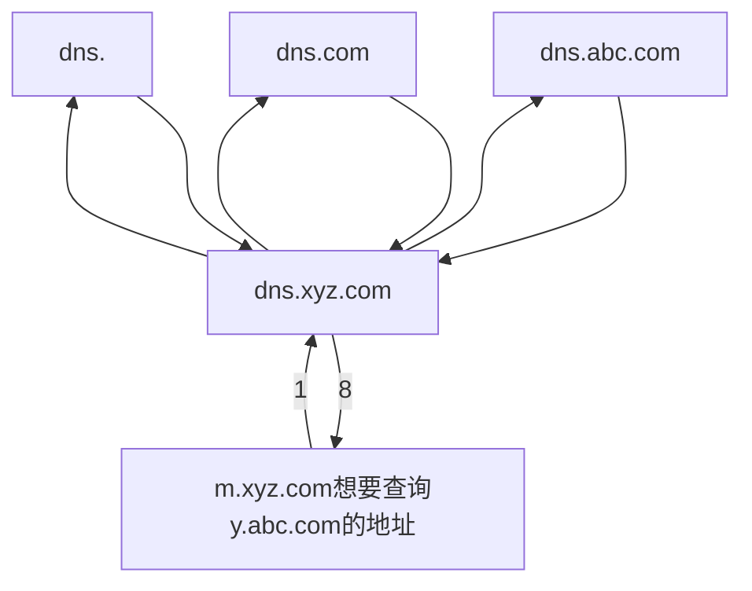

[toc]

# CN_@DNS@HTTP

## 域名的对应关系

- 如果一台主机通过两块网卡连接到两个网络（如服务器双线接入），那么就具有两个P地址，每个网卡对应一个MAC地址，显然这两个P地址可以映射到同一个域名上。
- 此外，多台主机也可以映射到同一个域名上（如负载均衡），
- 一台主机也可以映射到多个域名上（如虚拟主机）。 

### 域名和IP地址

- Internet上提供访问的主机一定要有IP地址，而不一定要有域名，
-  **域名在不同的时间可以解析出不同的IP地址**，因此**可以用多台服务器来分担负载** 。
- 也可以把多个域名指向同一台主机IP地址，
-  IP子网中主机也可以由不同的域名服务器来维护其映射，D对。

## 域名服务器

- 域名系统(Domain Name System)；
- 域名服务器(Domain Name Server)；
- 域名服务(Domain Name Service)

- 因特网的域名系统被设计成一个**联机分布式的数据库系统**，并采用客户/服务器模型。
- 域名到IP地址的解析是由运行在域名服务器上的程序完成的，一个服务器所负责管辖的（或有权限的）范围称为区(不以“域”为单位)，各单位根据具体情况来划分自己管辖范围的区，但在一个区中的所有结点必须是能够连通的，每个区设置相应的权限域名服务器，用来保存该区中的所有主机的域名到IP地址的映射。
- 每个域名服务器不但能够进行一些域名到IP地址的解析，而且还必须具有连向其他域名服务器的信息。
- 当自己不能进行域名到IP地址的转换时，能够知道到什么地方去找其他域名服务器。
- DNS使用了大量的域名服务器，它们以层次方式组织。
- 没有一台域名服务器具有因特网上所有主机的映射，相反,该映射分布在所有的DNS上。
- 主要有4种类型的域名服务器

### 1.根域名服务器

- 根域名服务器是最高层次的域名服务器，所有的根域名服务器都知道所有的顶级域名服务器的IP地址。根域名服务器也是最重要的域名服务器，
- 不管是哪个本地域名服务器，若要对因特网上任何一个域名进行解析，**只要自己无法解析，就首先要求助于根域名服务器。**

- 因特网上有13个根域名服务器，尽管我们将这13个根域名服务器中的每个都视为单个服务器，但每个“服务器”实际上是冗余服务器的集群，以提供安全性和可靠性。
- 根域名服务器用来管辖顶级域(如.com),通常它并不直接把待查询的域名直接转换成IIP地址，而是告诉本地域名服务器**下一步应当找哪个顶级域名服务器进行查询**。

#### 根域名服务器共有13 套装置

- <u>根域名服务器共有**13** 套装置，**不是13 个机器**。</u>
- 这些根域名服务器相应的域名分别是：
  - a.rootservers.net
  - b.rootservers.net
  - …
  - m.rootservers.net
- 到2016年2月，全世界已经在588 个地点安装了根域名服务器，使世界上大部分DNS 域名服务器都能就近找到一个根域名服务器。

#### ping rootservers.net

- ```bash
  PS C:\Users> ping a.rootservers.net
  
  Pinging a.rootservers.net [35.186.238.101] with 32 bytes of data:
  Reply from 35.186.238.101: bytes=32 time=98ms TTL=49
  Reply from 35.186.238.101: bytes=32 time=95ms TTL=49
  Reply from 35.186.238.101: bytes=32 time=101ms TTL=49
  Reply from 35.186.238.101: bytes=32 time=112ms TTL=49
  
  Ping statistics for 35.186.238.101:
      Packets: Sent = 4, Received = 4, Lost = 0 (0% loss),
  Approximate round trip times in milli-seconds:
      Minimum = 95ms, Maximum = 112ms, Average = 101ms
  ```

  

### 2.顶级域名服务器

- 这些域名服务器负责管理**在该顶级域名服务器注册的**所有**二级域名**。
- 收到DNS查询请求时，就给出相应的回答(可能是最后的结果，也可能是下一步应当查找的域名服务器的IP地址)。

### 3.投权域名服务器（权限域名服务器）

- 每台主机都必须在授权域名服务器处登记。为了更加可靠地工作，一台主机最好至少有两个授权域名服务器。实际上，许**多域名服务器**都同时充当**本地域名服务器和授权域名服务器**。
- 授权域名服务器总能将其管辖的主机名转换为该主机的IP地址。

### 4.本地域名服务器

- 本地域名服务器对域名系统非常重要。每个因特网服务提供者(SP),或一所大学，甚至一所大学中的各个系，都可以拥有一个本地域名服务器。
- 当一台主机发出DNS查询请求时，这个查询请求报文就发送给该主机的本地域名服务器。
- 事实上，我们在Windows系统中配置“本地连接”时，就需要填写DNS地址，这个地址就是本地DNS（域名服务器）的地址。

## 域名解析过程

### 递归查询

- 使用的较少

- ```mermaid
  flowchart LR
  
  	client[m.xyz.com想要查询y.abc.com的地址]--1--> local[dns.xyz.com]--->root --> top[dns.com] -->right[dns.abc.com]
  	right-->top-->root-->local--8-->client
  ```

  

### 迭代查询

- 递归和迭代相结合查询



### 例

- [2016统考真]

  - 假设所有域名服务器均采用迭代查询方式进行域名解析。
  - 当主机访问规范域名为www.abc.Xyz.com的网站时，**本地域名服务器**在完成该域名解析的过程中，
  - 可能**发出DNS查询**的最少和最多次数分别是（C）。
    - A.0,3
      B.1,3
      C.0,4
      D.1,4

- 最少情况下： 当本机 DNS高速缓存中存有该域名的DNS信息时，则不 需要查询任何域名服务器，这样最少发出0次DNS查询。

- 最多情况下：因为均采用迭代查询的方式，在最坏的情况下，本地域名服务器 需要依次迭代地向

  - 根域名服务器(dns.) 、顶级域名服务器 (dns.com.)、二级服务器(dns.xyz.com) ,三级(dns.abc.xyz.com)和发出DNS查询 请求，因此 最多发出4次DNS查询。

  - | 次数                         | 1次     | 2次         | 3次             | 4次             |
    | ---------------------------- | ------- | ----------- | --------------- | --------------- |
    | 查询的服务器                 | dns.    | dns.com     | dns.xyz.com     | dns.abc.xyz.com |
    | 查询结果(各级服务器的IP地址) | dns.com | dns.xyz.com | dns.abc.xyz.com | www.abc.xyz.com |

  - 可见,第四次查询后,得到目标域名www.abc.xyz.com 的IP地址

### 例

[2020统考真题]

-  网络中的本地域名服务器只提供递归查询服务，其他域名服务器均只提供迭代查询服务；
- **局域网内主机**访问Internet上各服务器的往返时间(RTT)均为I0ms,
- **忽略其他各种时延**。
- 若主机H通过超链接S=<u>http:/www,abc.com/index,html</u>请求浏览纯文本Web页index.html,
- 则从单击超链接开始到浏览器接收到index.html页面为止，所需的最短时间与最长时间分别是?
- 分析:
  - 最好情况下,本地局域网内的本地域名服务器的高速缓存中有超链接S所在主机的IP地址映射
  - 由于忽略其他各种延时,所认为从域名映射到IP地址的耗时为0
  - 得到需要的IP地址后,访问http资源,首先建立TCP链接,需要耗费一个往返时间RTT(第一次握手和第二次握手)
  - 数据传输(加载资源也消耗一个往返延时RTT
  - 所以至少需要2个RTT延时才能够加载到资源
  - 最坏情况下,需要一次查询
    - dns.
    - dns.com.
    - dns.abc.com
      - 这一次查询得到了www.abc.com的IP地址
    - 三次查询耗费三个RTT
      - (三次查询都是UDP基础上,是无连接的)
    - 再算上资源加载的需要的2个RTT,共5个RTT
  - 所以最短时间和最长时间分别为20ms和50ms

## HTTP协议

- [Hypertext Transfer Protocol - Wikipedia](https://en.wikipedia.org/wiki/Hypertext_Transfer_Protocol)

- HTTP 协议和 TCP/IP 协议族内的其他众多的协议相同，用于客户端和服务器之间的通信。

- 请求访问文本或图像等资源的一端称为客户端，而提供资源响应的一端称为服务器端。

- 在两台计算机之间使用 HTTP 协议通信时，在一条通信线路上必定有一端是客户端，另一端则是服务器端。


- 有时候，按实际情况，两台计算机作为客户端和服务器端的角色有可能会互换。
- 但就仅从一条通信路线来说，服务器端和客户端的角色是确定的，而用 HTTP 协议能够明确区分哪端是客户端，哪端是服务器端。

HTTP 协议规定，请求从客户端发出，最后服务器端响应该请求并返回。

- 肯定是**先从客户端**开始**建立通信**的，服务器端<u>在没有接收到请求之前不会发送响应</u>。

### HTTP特点

- HTTP使用TCP作为运输层协议，保证了数据的可靠传输。
- HTTP不必考虑数据在传输过程中被丢弃后又怎样被重传。
  - 但是，HTTP本身是无连接的（务必注意）。
  - 也就是说，虽然HTTP使用了TCP连接，但通信的双方在交换HTTP报文之前不需要先建立HTTP连接。

### http的无状态

- 使用 HTTP 协议，每当有新的请求发送时，就会有对应的新响应产生。
  - 也就是说，同一个客户第二次访问同一个服务器上的页面时，服务器的响应与第一次被访问时的相同。
  - 因为服务器并不记得曾经访问过的这个客户，也不记得为该客户曾经服务过多少次。
  - 协议本身并**不保留之前一切的请求或响应报文的信息**。
  - 这是为了更快地处理大量事务，确保协议的可伸缩性，而特意把 HTTP 协议设计成如此简单的。
- 可是，随着 Web 的不断发展，因**无状态而导致业务处理变得棘手的情况增多了**。
  - 比如，用户登录到一家购物网站，即使他跳转到该站的其他页面后，也需要能继续保持登录状态。
  - 针对这个实例，网站为了能够掌握是谁送出的请求，需要保存用户的状态。

## Cookie


- HTTP/1.1 虽然是无状态协议，但为了实现期望的保持状态功能，于是引入了 Cookie 技术。
  - 有了 Cookie 再用 HTTP 协议通信，就可以管理状态了。

- HTTP的无状态特性简化了服务器的设计，使服务器更容易支持大量并发的HTTP请求。
  - 在实际应用中，通常使用Cook加数据库的方式来跟踪用户的活动 

### Cookie的工作原理：

- 保留无状态协议这个特征的同时又要解决类似的矛盾问题，于是引入了 Cookie 技术。
- 当用户浏览某个使用Cookie的网站时，该网站服务器就**为用户产生一个唯一的识别码**，如“123456”，
- 接着在给用户的**响应报文**中添加一个Set-cookie的首部行:“Set cookie:123456”。

- 用户收到响应后，就在它管理的特定**Cookie文件**中添加这个**服务器的主机名和Cook识别码**，
- 当用户继续浏览这个网站时，会取出这个网站的识别码，并**放入请求报文的Cookie首部行**“Cookie:123456”。
  - 服务器**根据请求报文中的Cookie识别码**就能从数据库中查询到该用户的活动记录，进而执行一些个性化的工作，如根据用户的历史浏览记录向其推荐新产品等。

### HTTP的连接类型

- HTTP既可以使用非持久连接，也可以使用持久连接(HTTP/1.1支持)。

#### 非持久连接

- 每个网页元素对象(如PEG图形、Flsh等)的传输都需要单独建立一个TCP连接， 

  - 第三次握手的报文段中**捎带了客户对万维网文档的请求**

- 请求一个万维网文档所需的时间是

  - **该文档的传输时间**$T_s$
    - 与文档大小成正比

  - **两倍往返时间RTT**(一个RTT用于TCP连接，另一个RTT用于请求和接收文档）。
    - 每个对象引用都导致2×RTT的开销，此外每次建立新的TCP连接都要分配缓存和变量，使万维网服务器的负担很重。

#### 持久连接

- 为解决上述 TCP 连接的问题，HTTP/1.1 出了持久连接（HTTP Persistent Connections，也称为 **HTTP keep-alive** 或HTTP connection reuse）的方法。
- **持久连接**:万维网服务器在发送响应后仍然保持这条连接，使同一个客户（浏览器）和该服务器可以继续在这条连接上传送后续的HTTP请求和响应报文
- 持久连接的特点是，只要任意一端没有明确提出断开连接，则保持 TCP 连接状态。
- 持久连接的好处在于减少了 TCP 连接的重复建立和断开所造成的额外开销，减轻了服务器端的负载。
- 另外，减少开销的那部分时间，使HTTP 请求和响应能够更早地结束，这样 Web 页面的显示速度也就相应提高了。
- 持久连接又分为非流水线和流水线两种方式。
  - 非流水线方式
    - **客户**在**收到前一个响应后才能发出下一个请求**，服务器发送完一个对象后，其TCP连接就处于空闲状态，浪费了服务器资源。
  - 流水的持久连接
    - HTTP/1.1的默认方式是使用**流水线的持久连接**，
    - 这种情况下，**客户**每遇到一个对象引用就立即发出一个请求，因而客户可以**逐个地连续发出对各个引用对象的请求。**
    - 如果所有的请求和响应都是**连续发送**的，那么**所有引用的对象共计**经历1个RTT延迟
      - 而不是像非流水线方式那样，**每个引用**都必须有1个RTT延迟。
    - 这种方式减少了TCP连接中的空闲时间，提高了效率。


### http请求/响应实例


#### HTTP/1.1 example of request / response transaction 

- Below is a sample HTTP transaction between an HTTP/1.1 client and an HTTP/1.1 server running on [www.example.com](https://en.wikipedia.org/wiki/Example.com), port80

##### Client request

```
GET / HTTP/1.1
Host: www.example.com
User-Agent: Mozilla/5.0
Accept: text/html,application/xhtml+xml,application/xml;q=0.9,image/avif,image/webp,*/*;q=0.8
Accept-Language: en-GB,en;q=0.5
Accept-Encoding: gzip, deflate, br
Connection: keep-alive
```

- A client request (consisting in this case of the request line and a few headers that can be reduced to only the `"Host: hostname"` header) is followed by a blank line, so that the request ends with a double end of line, each in the form of a [carriage return](https://en.wikipedia.org/wiki/Carriage_return) followed by a [line feed](https://en.wikipedia.org/wiki/Line_feed). The `"Host: hostname"` header value distinguishes between various [DNS](https://en.wikipedia.org/wiki/Domain_Name_System) names sharing a single [IP address](https://en.wikipedia.org/wiki/IP_address), allowing name-based [virtual hosting](https://en.wikipedia.org/wiki/Virtual_hosting). While optional in HTTP/1.0, it is mandatory in HTTP/1.1. (A "/" (slash) will usually fetch a [/index.html](https://en.wikipedia.org/wiki/Webserver_directory_index) file if there is one.)


##### Server response

```http
HTTP/1.1 200 OK
Date: Mon, 23 May 2005 22:38:34 GMT
Content-Type: text/html; charset=UTF-8
Content-Length: 155
Last-Modified: Wed, 08 Jan 2003 23:11:55 GMT
Server: Apache/1.3.3.7 (Unix) (Red-Hat/Linux)
ETag: "3f80f-1b6-3e1cb03b"
Accept-Ranges: bytes
Connection: close

<html>
  <head>
    <title>An Example Page</title>
  </head>
  <body>
    <p>Hello World, this is a very simple HTML document.</p>
  </body>
</html>
```

- The [ETag](https://en.wikipedia.org/wiki/HTTP_ETag) (entity tag) header field is used to determine if a cached version of the requested resource is identical to the current version of the resource on the server. `"Content-Type"` specifies the [Internet media type](https://en.wikipedia.org/wiki/Internet_media_type) of the data conveyed by the HTTP message, while `"Content-Length"` indicates its length in bytes. The HTTP/1.1 [webserver](https://en.wikipedia.org/wiki/Webserver) publishes its ability to respond to requests for certain byte ranges of the document by setting the field `"Accept-Ranges: bytes"`. This is useful, if the client needs to have only certain portions[[61\]](https://en.wikipedia.org/wiki/Hypertext_Transfer_Protocol#cite_note-67) of a resource sent by the server, which is called [byte serving](https://en.wikipedia.org/wiki/Byte_serving). When `"Connection: close"` is sent, it means that the [web server](https://en.wikipedia.org/wiki/Web_server) will close the [TCP](https://en.wikipedia.org/wiki/Transmission_Control_Protocol) connection immediately after the end of the transfer of this response.[[21\]](https://en.wikipedia.org/wiki/Hypertext_Transfer_Protocol#cite_note-rfc9112-9.1-21)

- Most of the header lines are optional but some are mandatory. When header `"Content-Length: number"` is missing in a response with an entity body then this should be considered an error in HTTP/1.0 but it may not be an error in HTTP/1.1 if header `"Transfer-Encoding: chunked"` is present. Chunked transfer encoding uses a chunk size of 0 to mark the end of the content. Some old implementations of HTTP/1.0 omitted the header `"Content-Length"` when the length of the body entity was not known at the beginning of the response and so the transfer of data to client continued until server closed the socket.

- A `"Content-Encoding: gzip"` can be used to inform the client that the body entity part of the transmitted data is compressed by gzip algorithm.

## HTTP报文总体结构

- HTTP是面向文本的(Text-Oriented)
- 报文中的每个字段都是一些ASCI码串，并且每个字段的长度都是不确定的。有两类HTTP报文：
  - 请求报文：从客户向服务器发送的请求报文
  - 响应报文：从服务器到客户的回答
- HTTP请求报文和响应报文都由三个部分组成
  -  这两种报文格式的区别就是开始行不同。

### 开始行：

- 用于区分是请求报文还是响应报文。
- 在**请求报文**中的开始行称为**请求行**，
- 在**响应报文**中的开始行称为**状态行**。
- 开始行
  - 含有的三个字段之间都以空格分隔，最后的“CR”和“LF”分别代表“回车”和“换行”。
  - **请求报文Requset**的“请求行”有三个内容：
    - 方法Method
      - “方法”是对所请求对象进行的操作，这些方法实际上也就是一些命令。
    - 请求资源的URL
    - HTTP的版本Version

### 首部行：

- 用来说明浏览器、服务器或报文主体的一些信息。
- 首部可以有几行，但也可以不使用。
- 在每个首部行中都有首部字段名和它的值，每一行在结束的地方都要有“回车”和“换行”。
- 整个首部行结束时，还有一空行将首部行和后面的实体主体分开。

### 实体主体：

- 在请求报文中一般不用这个字段，而在响应报文中也可能没有这个字段。
- 可以使用Wireshark捕获的HTTP请求报文

## HTTP两类报文具体结构和实例

### 请求报文结构🎈

- 请求报文[Hypertext Transfer Protocol HTTP/1.1.request message - Wikipedia](https://en.wikipedia.org/wiki/Hypertext_Transfer_Protocol#HTTP/1.1_request_messages)

#### HTTP/1.1 request messages

##### Request syntax

- A client sends *request messages* to the server, which consist of 

  - a **request line**, consisting of <u>the case-sensitive</u> 

    - request method, 
    - a [space](https://en.wikipedia.org/wiki/Space_(punctuation)), 
    - the requested URL,
    - another space, 
    - the protocol version(protocol/version),
    - a [carriage return](https://en.wikipedia.org/wiki/Carriage_return), and a [line feed](https://en.wikipedia.org/wiki/Line_feed), (CRLF回车换行)

  - e.g.:

    - ```
      GET /images/logo.png HTTP/1.1
      
      ```

- zero or more [request header fields](https://en.wikipedia.org/wiki/HTTP_request_header_field) (at least 1 or more headers in case of HTTP/1.1), 

  - each consisting of the case-insensitive field name, a colon, optional leading [whitespace](https://en.wikipedia.org/wiki/Whitespace_(computer_science)), the field value, an optional trailing whitespace and ending with a carriage return and a line feed,

  -  e.g.:

     - ```
       Host: www.example.com
       Accept-Language: en
       ```

- an empty line,

  - consisting of a carriage return and a line feed;

- an optional [message body](https://en.wikipedia.org/wiki/HTTP_message_body).

##### optional@required header fields

- In the HTTP/1.1 protocol, all header fields except `Host: hostname` are optional.

- A request line containing only the path name is accepted by servers to maintain compatibility with HTTP clients before the HTTP/1.0 specification in [RFC](https://en.wikipedia.org/wiki/RFC_(identifier)) [1945](https://datatracker.ietf.org/doc/html/rfc1945).[[47\]](https://en.wikipedia.org/wiki/Hypertext_Transfer_Protocol#cite_note-apacheweek_com-http11-51)


##### 示意图

- 

- 

  

### 响应报文结构🎈

#### HTTP/1.1 response messages

A response message is sent by a server to a client as a reply to its former request message.[[note 4\]](https://en.wikipedia.org/wiki/Hypertext_Transfer_Protocol#cite_note-http-23-message-49)

##### Response syntax

A server sends *response messages* to the client, which consist of:  

- a **status line**, consisting of 
  - the protocol version, 
  - a [space](https://en.wikipedia.org/wiki/Space_(punctuation)), 
  - the [response status code](https://en.wikipedia.org/wiki/List_of_HTTP_status_codes), 
  - another space, 
  - a possibly empty **reason phrase**, 
  - a [carriage return](https://en.wikipedia.org/wiki/Carriage_return) and a [line feed](https://en.wikipedia.org/wiki/Line_feed), e.g.:

```
HTTP/1.1 200 OK
```

- zero or more [response header fields](https://en.wikipedia.org/wiki/HTTP_response_header_field)
  -  each consisting of
     -  the case-insensitive field name,
     -  a colon,
     -  optional leading [whitespace](https://en.wikipedia.org/wiki/Whitespace_(computer_science)), 
     -  the field value,
     -  an optional trailing whitespace 
     -  ending with a carriage return and a line feed, e.g.:

```
Content-Type: text/html
```

- an empty line, consisting of a carriage return and a line feed;
- an optional [message body](https://en.wikipedia.org/wiki/HTTP_message_body).

##### 响应报文示意图

- 

- 


- 在起始行开头的 HTTP/1.1 表示服务器对应的 **HTTP 版本**。

- 紧挨着的 **200 OK** 表示请求的处理结果的**状态码（status code）**和**原因短语（reason-phrase）**。
- 响应首部
  - 显示了**创建响应的日期时间**，是**首部字段（header field）内的一个属性**。
- 响应主体
  - 以一空行分隔，之后的内容称为**资源实体的主体（entity body）**。

- **响应报文**基本上由
  - 协议版本
  - 状态码（表示请求成功或失败的数字代码）、
  - 用以解释状态码的原因短语、
  - 可选的响应首部字段以及
  - 实体主构成

## 告知服务器意图的 HTTP 方法🎈


- | 方法    | 说明                   | 支持的HTTP协议版本 |
  | ------- | ---------------------- | ------------------ |
  | GET     | 获取资源               | 1.0、1.1           |
  | POST    | 传输实体主体           | 1.0、1.1           |
  | PUT     | 传输文件               | 1.0、1.1           |
  | HEAD    | 获得报文首部           | 1.0、1.1           |
  | DELETE  | 删除文件               | 1.0、1.1           |
  | OPTIONS | 询问支持的方法         | 1.1                |
  | TRACE   | 追踪路径               | 1.1                |
  | CONNECT | 要求用隧道协议连接代理 | 1.1                |


## http响应状态码参考

- |      | 类别                            | 原因短语                   |
  | ---- | ------------------------------- | -------------------------- |
  | 1XX  | Informational ( 信息性状态码)   | 接收的请求正在处理         |
  | 2XX  | Success (成功状态码)            | 请求正常处理完毕           |
  | 3XX  | Redirection ( 重定向状态码)     | 需要进行附加操作以完成请求 |
  | 4XX  | Client Error(客户端错误状态码)  | 服务器无法处理请求         |
  | 5XX  | Server Error (服务器错误状态码) | 服务器处理请求出错         |


