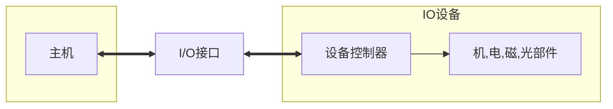

[toc]

## IO系统构成

- IO系统由IO软件和IO硬件构成
  - IO软件包括:
    - 驱动程序
    - 用户程序
    - 管理程序
    - 升级补丁
    - 采用**IO指令**和**通道指令**实现CPU与IO设备的信息交换
  - IO硬件:
    - 外设
    - 数倍控制器
    - 接口
    - IO总线
    - ...

### IO设备的结构框图

   - 

#### IO设备

- 主机(cpu+内存)外,的大部分硬件设备都可以称为IO设备/外部设备
- 外部设备:包括
  - **IO设备**
  - 通过<u>IO接口</u>才能够访问的**外存设备**
- 有的设备同时具有输入输出功能

##### IO设备分类

- 人机交互设备
  - 鼠标/键盘..
  - 打印机/显示器..
- 计算机信息存储设备
  - 用于存储系统软件等有用信息,量极大
  - 存储设备多数可以作为计算机系统的辅助存储器
    - 磁盘
    - 光盘
    - 磁带
    - ...
- 机器间通信设备
  - 用于完成机器间通信任务的设备
    - 电话线
    - 调制解调器Modem
    - 模数/数模转换设备

#### 打印机

- 按照打字原理划分:
  - 打击式
  - 非打击式
- 按照能否打印汉字划分:
  - 点阵式
  - 活字式

#### 汉字的存储

- 汉字内码
  - 每个内码占用2B
- 汉字字形码
  - 简易型的汉字为16x16点阵
  - 高精度为24x24点阵或者32x32点阵表示
  - 字模点阵的信息量很大,简易型的16x16点阵的一个字就需要
    - $(16\times{16})bit/(8bit/B)=2^5B$),32个字节
  - 国标常用汉字有6763个左右,大约占用256k

#### 外部存储器

- 磁表面存储器

  - 把某些磁性材料薄薄地涂在金属铝或者塑料表面上作为载磁体来存储信息
    - 磁盘存储器
    - 磁带存储器
    - 磁鼓存储器
  - **磁盘驱动器**向盘片磁道记录数据时,采用串行方式写入
  - 磁盘驱动器/磁盘:由磁头,磁盘读写电路等组成,简称为**磁盘**
    - 可见,磁盘驱动器不是IO接口

- 固态硬盘

- 光盘存储器

  - 利用光学原理进行读写信息的存储装置
  - 令聚焦激光束对盘介质以非接触式方式记录信息
  - 光盘系统
    - 光盘片
    - 光盘驱动器
    - 光盘控制器

  

#### 显示器

- 分为图形显示器和图像显示器
- 图形显示器显示的图形又称为主观图像或计算机图像
- 图像显示器显示的图像称为客观图像

- 此处主要讨论:
  - 显存即<u>显示存储器</u>VRAM(或叫<u>刷新存储器</u>)
    - 可以用DRAM实现

##### 显示器刷新存储器VRAM

- VRAM中存储单元的字长取决于显示的**颜色数**
- 颜色数为m
- 则字长为**灰度级位数(**色深)K$=\log_2{m}$
- 设VRAM的容量分别为S,显示器的帧频为f,分辨率为N
  - VRAM容量$S=分辨率\times灰度级位数=NK$
- 刷新带宽$W=S\times{f}=NKf$

- 显存带宽
  - 刷新带宽(速率)=分辨率x色深x帧频
- 刷新带宽
  - 占用显存带宽
- 例
  - 如果刷新带宽要求为Q,且占用了50%的VRAM总带宽(W)
  - 则Q=0.5W
  - W=2Q

### IO接口(interface)

- 即**IO控制器**(区别于**设备控制器**)

- 通常指的是主机和IO设备之间设置的一个**硬件电路**机器相应的**软件**
- 在各个外设和主机之间传输数据时进行各种协调工作的逻辑部件
  - 协调包括传输过程的速度的匹配,电平/格式转换

### IO接口功能

- 地址译码和设备选择(选址功能)
- 实现主机**和外设的通信**联络控制
- 实现数据缓冲
- 信号格式转换
- 传送**控制**命令
  - IO操作控制和定时
- 反映IO设备工作**状态信息**
  - IO过程中错误和**状态检测**

### IO接口与总线

- IO接口在主机侧通过**IO总线**和内存/cpu相连
- 通过数据总线,在数据缓冲存储器与内存/cpu的寄存器之间进行数据传送
- 接口和设备的状态信息被记录在**状态寄存器**中
  - 状态信息通过**数据线**将状态信息送到cpu
- cpu对外设的控制命令也通过**数据线**传送
  - 一般将其送到IO接口的**控制寄存器**
- 通过数据线传送内容的寄存器:
  - 数据缓冲寄存器
  - 命令/状态寄存器
- 状态寄存器和控制寄存器在**传输方向上是相反的**

#### IO总线上传输的信息

- 数据线传送内容
  - IO接口中的**命令字**/**状态字**/**中断类信号**都是用数据线传送的

- 地址线传输内容:

  - 地址线用于传送的内容是**与Cpu交换数据的端口地址**

- 控制线传输内容:

  - 给IO端口发送读写信号,对端口进行读写控制

  

### IO接口分类

- 按数据传送方式(格式)分类
  - 并行接口
  - 串行接口
  - 指的是外设和接口一侧的传输方式

- 按功能选择的灵活性分类
  - 可编程接口
  - 不可编程接口

- 按通用性分类
- 按数据传输的**控制方式**(简称:<u>IO控制方式</u>或<u>IO方式</u>)
  - 程序型接口
    - 适用于慢速的IO设备
      - 终端/键盘/打印机
    - 程序中断接口也属于程序型
  - DMA型接口
    - 连接**高速IO设备**,比如:磁盘/磁带

### 端口(port)

- 和接口不同
- 端口指的是接口电路中的一些寄存器(数据端口/控制端口/状态端口),分别存放
  - 数据信息
  - 控制信息
  - 状态信息
- 或者说,IO接口中,cpu访问的寄存器称为**IO端口**
- 若干端口加上控制逻辑构成接口

### IO端口和编址

- 编址方式
  - 有独立编址(IO映射方式)
    - IO端口地址空间和主存地址空间是相独立的
      - 无法从地址码上来区分(靠不同的**IO指令来区分**)
        - 意味着,独立编址方式允许IO端口的地址和主存地址相同,而不影响区分
      - 需要设置专门的IO指令来访问IO端口
      - 便于程序编址,易于理解
      - 需要两组控制信号,增加控制的复杂性
        - 指的是cpu提供存储器读写,IO设备读写这两组控制信号
  - 存储器统一编址(存储器映射方式)
    - 用统一的访存指令就可以访问IO端口
    - 无需IO指令
    - 靠地址码来区分
      - 是指令地址码而不是地址线
      - 可见,在同一编址的情况下,IO端口的地址和主存地址不可相同,否则无法区分
    - 统一编址要求相对固定在地址的某部分
      - 比如固定在高地址或者低地址
      - 但不是随意任何地址

### 几种地址的区别

- 物理地址:
  - 外部链接使用,是**唯一**的,与地址总线相对应
  - 在内存中的实际地址就是物理地址
- 逻辑地址
  - 内部和编程使用,**不唯一**
- 

### cpu与端口

- cpu对控制端口只能执行写操作
- CPU对状态端口只能执行读操作
- cpu通过IO指令从端口读取信息
  - 通过输出指令,将信息写入到端口中
- 状态端口和控制端口可以合用同一个寄存器

### 设备控制器

- 不同的IO设备具有其相应的设备控制器DC
  - 它们往往是通过IO接口和主机取得联系

## IO指令

- 属于指令系统的一部分(**机器指令**的一类)

- 但是为了反映IO设备交互的特点,**指令格式**和其他通用指令不同

- 通过IO指令来完成对数据缓冲存储器,状态/控制寄存器的访问操作

  - IO指令实现的数据传送通常发生在**通用寄存器和IO端口之间**

- IO指令是一种特权指令,只能够在内核的底层IO软件中使用

  

## IO控制方式

- 在IO系统传输数据有不同的IO控制方式

  - 程序查询方式

    - cpu通过程序不断查询IO设备是否已经做好准备

  - 程序中断方式

    - 在IO设备准备就绪并向cpu发中断请求时才予以相应

  - DMA方式

    - 主存与IO设备之间有一条直接数据通路
    - IO设备和主存交换信息不需要调用中断服务程序

  - 通道方式

    - 系统中设有通道控制部件
      - 通道程序存放在主存中
      - 有通道从主存中取出并执行,即通道程序有通道执行
        - 只能在具有通道的IO系统中执行
    
    - 每个通道挂接若干外设
    - 适用于传输速率较高的设备
    

