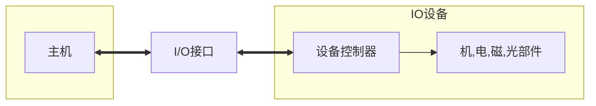

[toc]

## IO系统构成

### IO软件和IO硬件

- IO系统由IO软件和IO硬件构成
  - IO软件包括:
    - 驱动程序
    - 用户程序
    - 管理程序
    - 升级补丁
    - 采用**IO指令**和**通道指令**实现CPU与IO设备的信息交换
  - IO硬件:
    - 外设
    - 数倍控制器
    - 接口
    - IO总线
    - ...

### IO设备的结构框图🎈

   - 

#### IO设备

- 主机(cpu+内存)外,的大部分硬件设备都可以称为IO设备/外部设备
- 外部设备:包括
  - **IO设备**
  - 通过<u>IO接口</u>才能够访问的**外存设备**
- 有的设备同时具有输入输出功能

##### IO设备分类

- 人机交互设备
  - 鼠标/键盘..
  - 打印机/显示器..
- 计算机信息存储设备
  - 用于存储系统软件等有用信息,量极大
  - 存储设备多数可以作为计算机系统的辅助存储器
    - 磁盘
    - 光盘
    - 磁带
    - ...
- 机器间通信设备
  - 用于完成机器间通信任务的设备
    - 电话线
    - 调制解调器Modem
    - 模数/数模转换设备

#### 打印机

- 按照打字原理划分:
  - 打击式
  - 非打击式
- 按照能否打印汉字划分:
  - 点阵式
  - 活字式

#### 汉字的存储

- 汉字内码
  - 每个内码占用2B
- 汉字字形码
  - 简易型的汉字为16x16点阵
  - 高精度为24x24点阵或者32x32点阵表示
  - 字模点阵的信息量很大,简易型的16x16点阵的一个字就需要
    - $(16\times{16})bit/(8bit/B)=2^5B$),32个字节
  - 国标常用汉字有6763个左右,大约占用256k

#### 外部存储器

- 磁表面存储器

  - 把某些磁性材料薄薄地涂在金属铝或者塑料表面上作为载磁体来存储信息
    - 磁盘存储器
    - 磁带存储器
    - 磁鼓存储器
  - **磁盘驱动器**向盘片磁道记录数据时,采用串行方式写入
  - 磁盘驱动器/磁盘:由磁头,磁盘读写电路等组成,简称为**磁盘**
    - 可见,磁盘驱动器不是IO接口

- 固态硬盘

- 光盘存储器

  - 利用光学原理进行读写信息的存储装置
  - 令聚焦激光束对盘介质以非接触式方式记录信息
  - 光盘系统
    - 光盘片
    - 光盘驱动器
    - 光盘控制器

  

#### 显示器

- 分为图形显示器和图像显示器
- 图形显示器显示的图形又称为主观图像或计算机图像
- 图像显示器显示的图像称为客观图像

- 此处主要讨论:
  - 显存即<u>显示存储器</u>VRAM(或叫<u>刷新存储器</u>)
    - 可以用DRAM实现

##### 显示器刷新存储器VRAM

- VRAM中存储单元的字长取决于显示的**颜色数**
- 颜色数为m
- 则字长为**灰度级位数(**色深)K$=\log_2{m}$
- 设VRAM的容量分别为S,显示器的帧频为f,分辨率为N
  - VRAM容量$S=分辨率\times灰度级位数=NK$
- 刷新带宽$W=S\times{f}=NKf$

- 显存带宽
  - 刷新带宽(速率)=分辨率x色深x帧频
- 刷新带宽
  - 占用显存带宽
- 例
  - 如果刷新带宽要求为Q,且占用了50%的VRAM总带宽(W)
  - 则Q=0.5W
  - W=2Q

## I/O设备 🎈

- I/O设备一般是由**执行I/O操作的机械部分**和**执行控制I/O的电子部件**组成。
- 通常将这**两部分分开**，
  - **执行I/O操作**的**机械部分**就是一般的**I/O设备**，
  - 执行**控制I/O的电子部件**则称为**设备控制器**,简称**控制器**或**适配器（adapter）**
    - 在微型机和小型机中的**控制器**常做成**印刷电路卡**形式，因而也常称为**控制卡、接口卡或网卡**，可将它插入计算机的扩展槽中。
  - 在有的大、中型计算机系统中，还配置了**I/O通道**或**I/O处理机**。

### 设备控制器DC🎈

- 不同的IO设备具有其自己的**相应的设备控制器**(DC)
  - 它们往往是**通过IO接口**和主机取得联系

#### 设备控制器主要功能

- **设备控制器**主要功能是，
  - **控制一个或多个I/O设备，以实现I/O设备和计算机之间的数据交换**。
  - 它是**CPU与I/O设备**之间的**接口**，接收从CPU发来的命令，去控制I/O设备工作，使处理机能够从繁杂的设备控制事务中解脱出来。
  - 设备控制器是一个**可编址的设备**，当它仅控制一个设备时，**它只有一个唯一的设备地址**；
  - 若控制器可连接多个设备，则应含有多个设备地址，每一个设备地址对应一个设备。

#### 设备控制器的基本功能

- 设备控制器的功能有：
  - ①接收和识别CPU发来的命令，如磁盘控制器能接收读、写、查找等命令：
  - ②数据交换，包括设备和控制器之间的数据传输，以及控制器和主存之间的数据传输：
  - ③标识和报告设备的状态，以供CPU处理；
  - ④地址识别：
  - ⑤数据缓冲：
  - ⑥差错控制。
- (1)接收和识别命令。
  - 设备控制器能接收并识别处理机发来的多种命令。
  - 在控制器中具有相应的**控制寄存器**，用来存放**接收的命令和参数**，并对所接收的**命令进行译码**。
  - 例如，**磁盘控制器**可以接收**CPU发来的**read、write,format等15条不同的命令，而且有些**命令还带有参数**。相应地，在磁盘控制器中**有多个寄存器和命令译码器**等。
- (2)数据交换。
  - **设备控制器**可实现**CPU与控制器之间、控制器与设备之间的数据交换**。
  - 对于前者，是通过**数据总线**，由CPU并行地把数据写入控制器，或从控制器中并行地读出数据。
  - 对于后者，是设备将数据输入到控制器，或从控制器传送给设备。
  - 为此，在控制器中须设置数据寄存器。
- (3)标识和报告**设备的状态**。
  - 控制器应记下设备的状态供CPU了解。
    - 例如，仅当该设备处于发送就绪状态时，CPU才能启动控制器从设备中读出数据。
  - 为此，在控制器中应设置一**状态寄存器**，用其中的**每一位反映设备的某一种状态**。
  - 当CPU将该寄存器的内容**读入后，便可了解该设备的状态**。
- (4)地址识别。
  - 就像内存中的**每一个单元都有一个地址一样**，系统中的**每一个设备也都有一个地址**。设备控制器必须能够识别其所控制的每个设备的地址。
  - 此外，为使CPU能向(或从)寄存器中写入(或读出)数据，这些寄存器都应**具有唯一的地址**。控制器应能正确识别这些地址。
  - 为此，在控制器中应配置**地址译码器**。
- (5)数据缓冲区。
  - 由于I/O设备的**速率较低**，而CPU和内存的速率却很高，故在控制器中必须**设置一缓冲区**。
  - 在输出时，用此缓冲区暂存由主机高速传来的数据，然后才**以与I/O设备所匹配的速率将缓冲器中的数据传送给I/O设备**。
  - 在输入时，缓冲区则用于暂存从I/O设备送来的数据，待接收到一批数据后，再将缓冲区中的数据高速地传送给主机。
- (6)差错控制。
  - 对于由I/O设备传送来的数据，**设备控制器还兼管进行差错检测**。若发现传送中出现了错误，通常是将差错检测码置位，并向CPU报告，于是**CPU将本次传送来的数据作废**，  =并重新进行一次传送。这样便可保证数据输入的正确性。

#### 设备控制器分成两类

- 一类是用于**控制字符设备**的控制器，
- 一类是用于**控制块设备**的控制器。

#### 设备控制器的组成🎈

- 由于设备控制器位于CPU与设备之间，它既要与CPU通信，又要与设备通信，还应具有按照CPU所发来的命令去控制设备工作的功能
- 大多数控制器都是由以下三部分组成:
  - 

#### 设备控制器与处理机的接口

- 该接口用于实现CPU与设备控制器之间的通信，在该接口中共有**三类信号线**:
  - 数据线、地址线和控制线。
  - **数据线**通常与**两类寄存器**相连接:
    - 第一类是**数据寄存器**，在控制器中可以有一个或多个数据寄存器，用于存放**从设备送来**的**数据**(输入)，或从CPU送来的数据(输出)。
    - 第二类是**控制/状态寄存器**，在控制器中可以有一个或多个这类寄存器，用于存放从CPU送来的**控制信息或设备的状态信息。**

#### IO逻辑

- IO逻辑用于实现**对设备的控制**。
- 它通过**一组控制线**与处理机交互，处理机**利用该逻辑向控制器发送IO命令**。
  - 每当CPU要**启动**一个设备时，一方面将启动命令发送给**控制器**，
  - 另一方面又同时**通过地址线**把**地址**发送给**控制器**，由**控制器的I/O逻辑**对收到的**地址译码**，再根据所**译出的命令**对所选设备进行控制。

#### 设备控制器与设备的接口

- 在**一个设备控制器**上，可以连接**一个或多个设备**。
- 相应的，在**控制器中**便有**一个或多个<u>设备接口</u>**。
  - 在**每个接口**中都存在**数据、控制和状态<u>三种类型的信号</u>**。
- 控制器中的**IO逻辑**根据**处理机发来的地址信号**去**选择一个设备接口**。

#### 数据信号线

- 用于在设备和设备控制器之间传送数据信号。
- 对输入设备而言，由外**界输入的信号经转换器转换后**，所形成的数据**通常先送入缓冲器中**，当<u>数据量达到一定的比特(字符)数后</u>，再从缓冲器**通过一组数据信号线**传送给**设备控制器**
- 对输出设备而言，则是将从设备控制器经过数据信号线传送来的一批数据**先暂存于缓冲器**中，经转换器作适当转换后，再逐个字符地输出。

#### 控制信号线

- 这是作为由设备控制器向I/O设备**发送控制信号时的通路**。
- 该信号规定了**设备将要执行的操作**，如读操作(指由设备向控制器传送数据)或写操作(从控制器接收数据)，或执行磁头移动等操作。

#### 状态信号线

- 该信号线用于传送**指示设备当前状态的信号**。
- 设备的当前状态有正在读(或写)；设备已读(写)完成，并准备好新的数据传送。

### IO接口(interface)🎈

- 即**IO控制器**

- IO接口和**设备控制器**含义应该是相同的
  - 从组成原理的角度更多的称为IO接口,并且做了一定的区分

  - 从操作系统的角度,更多的称为设备控制器

- IO接口通常指的是**主机和IO设备之间**设置的一个**硬件电路**及其相应的**软件**
- 在各个外设和主机之间传输数据时**进行各种协调工作**的逻辑部件
  - 包括
    - 传输过程的速度的匹配,
    - 电平/格式转换

#### IO接口功能@设置接口的理由

- 地址译码和设备选择(选址功能)
- 实现主机**和外设的通信**联络控制
- 实现数据缓冲
- 信号格式转换
- 传送**控制**命令
  - IO操作控制和定时
- 反映IO设备工作**状态信息**
  - IO过程中错误和**状态检测**
  - 例如,接口内设置一些反映设备工作状态的触发器
    - 用完成触发器D和工作触发器B来标志设备所处的状态
    - 当D=0,B=0时，表示/0设备处于暂停状态。
      当D=1,B=0时，表示I/O设备已经准备就绪。
      当D=0,B=1时，表示I/O设备正处于准备状态。

#### I/O接口的基本组成

- 由于现代计算机系统中大多采用中断技术，因此接口电路中一般还设有中断请求触发器INTR,当其为“1”时，表示该I/O设备向CPU发出中断请求。
- 接口内还有屏蔽触发器MASK,它与中断请求触发器配合使用，完成设备的屏蔽功能 
- 所有的状态标志触发器都与I/O总线中的状态线相连。
- 此外，不同的I/O设备的接口电路中还可根据需要增设一些其他状态标志触发器，如“出错”触发器、“数据迟到”触发器，或配置一些奇偶校验电路、循环码校验电路等。
- 随着大规模集成电路制作工艺的不断进步，目前大多数I/O设备所共用的电路都制作在一个芯片内，作为通用接口芯片。
- 另一些I/O设备专用的电路，制作在I/O设备的设备控制器中。
- 

#### IO接口与总线

- IO接口在主机侧通过**IO总线**和内存/cpu相连
- 通过数据总线,在数据缓冲存储器与内存/cpu的寄存器之间进行数据传送
- 接口和设备的状态信息被记录在**状态寄存器**中
  - 状态信息通过**数据线**将状态信息送到cpu
- cpu对外设的控制命令也通过**数据线**传送
  - 一般将其送到IO接口的**控制寄存器**
- 通过数据线传送内容的寄存器:
  - 数据缓冲寄存器
  - 命令/状态寄存器
- 状态寄存器和控制寄存器在**传输方向上是相反的**

#### IO总线

- 数据线
- 设备选择线
- 命令线
- 状态线

##### (1)数据线

- 数据线是/0设备与主机之间**数据代码的传送线**，其根数一般等于存储字长的位数或字符的位数，它通常是双向的，也可以是单向的。若采用单向数据总线，则必须用两组才能实现数据的输入和输出功能，而双向数据总线只需一组即可。

##### (2)设备选择线

- 设备选择线是用来传送**设备码**的，它的根数取决于**I/O指令中设备码的位数**。
- 如果<u>把设备码看做是地址号</u>，那么设备选择线又可称为**地址线**。
- 设备选择线**可以有一组，也可以有两组**，
  - 其中一组用于主机向I/O设备发送设备码，
  - 另一组用于I/O设备向主机回送设备码。
- 当然设备选择线也可采用一组双向总线代替两组单向总线。

##### (3)命令线

- 命令线主要用以**传输CPU向设备发出的各种命令信号**，如启动、清除、屏蔽、读、写等。
- 它是一组**单向总线**，其根数**与命令信号多少有关**。

##### (4)状态线

- 状态线是**将I/O设备的状态向主机报告**的信号线，
- 例如，设备是否准备就绪，是否向CPU.发出中断请求等。
- 它也是**一组单向总线**。现代计算机中大多采用三态逻辑电路来构成总线。

#### IO总线上传输的信息

- 数据线传送内容
  - IO接口中的**命令字**/**状态字**/**中断类信号**都是用数据线传送的

- 地址线传输内容:

  - 地址线用于传送的内容是**与Cpu交换数据的端口地址**

- 控制线传输内容:

  - 给IO端口发送读写信号,对端口进行读写控制

  

#### IO接口分类

- 按数据传送方式(格式)分类
  - 并行接口
  - 串行接口
  - 指的是外设和接口一侧的传输方式

- 按功能选择的灵活性分类
  - 可编程接口
  - 不可编程接口

- 按通用性分类
- 按数据传输的**控制方式**(简称:<u>IO控制方式</u>或<u>IO方式</u>)
  - 程序型接口
    - 适用于慢速的IO设备
      - 终端/键盘/打印机
    - 程序中断接口也属于程序型
  - DMA型接口
    - 连接**高速IO设备**,比如:磁盘/磁带

### 端口(port)

- 端口和接口不同
- 端口指的是**接口电路**中的一些**寄存器**(数据端口/控制端口/状态端口),分别存放
  - 数据信息
  - 控制信息
  - 状态信息
- IO接口中,cpu访问的寄存器称为**IO端口**

### 接口和端口的联系和区别🎈

- **若干端口加上控制逻辑构成接口**

#### IO端口和编址

- 编址方式
  - 有独立编址(IO映射方式)
    - IO端口地址空间和主存地址空间是相独立的
      - 无法从地址码上来区分(靠不同的**IO指令来区分**)
        - 意味着,独立编址方式允许IO端口的地址和主存地址相同,而不影响区分
      - 需要设置专门的IO指令来访问IO端口
      - 便于程序编址,易于理解
      - 需要两组控制信号,增加控制的复杂性
        - 指的是cpu提供存储器读写,IO设备读写这两组控制信号
  - 存储器统一编址(存储器映射方式)
    - 用统一的访存指令就可以访问IO端口
    - 无需IO指令
    - 靠地址码来区分
      - 是指令地址码而不是地址线
      - 可见,在同一编址的情况下,IO端口的地址和主存地址不可相同,否则无法区分
    - 统一编址要求相对固定在地址的某部分
      - 比如固定在高地址或者低地址
      - 但不是随意任何地址

#### 几种地址的区别

- 物理地址:
  - 外部链接使用,是**唯一**的,与地址总线相对应
  - 在内存中的实际地址就是物理地址
  
- 逻辑地址
  - 内部和编程使用,**不唯一**
  
  

#### cpu与端口

- cpu对控制端口只能执行写操作
- CPU对状态端口只能执行读操作
- cpu通过IO指令从端口读取信息
  - 通过输出指令,将信息写入到端口中
- 状态端口和控制端口可以合用同一个寄存器

## IO指令

- 属于指令系统的一部分(**机器指令**的一类)

- 但是为了反映IO设备交互的特点,**指令格式**和其他通用指令不同

- 通过IO指令来完成对数据缓冲存储器,状态/控制寄存器的访问操作

  - IO指令实现的数据传送通常发生在**通用寄存器和IO端口之间**

- IO指令是一种特权指令,只能够在内核的底层IO软件中使用

  

## IO控制方式

- 在IO系统传输数据有不同的IO控制方式

  - 程序查询方式

    - cpu通过程序不断查询IO设备是否已经做好准备

  - 程序中断方式

    - 在IO设备准备就绪并向cpu发中断请求时才予以相应

  - DMA方式

    - 主存与IO设备之间有一条直接数据通路
    - IO设备和主存交换信息不需要调用中断服务程序

  - 通道方式

    - 系统中设有通道控制部件
      - 通道程序存放在主存中
      - 有通道从主存中取出并执行,即通道程序有通道执行
        - 只能在具有通道的IO系统中执行
    
    - 每个通道挂接若干外设
    - 适用于传输速率较高的设备
    

