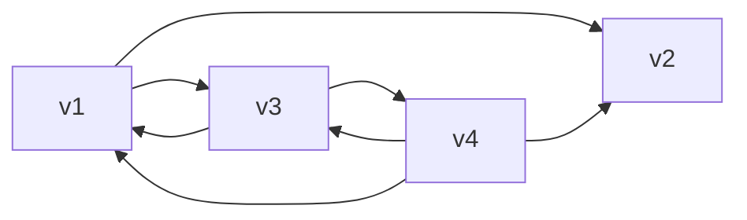

[toc]


## 邻接矩阵法

## 邻接表法

## 十字链表法

- 用于存储`有向图`的一种**链式存储结构**

### 弧的两要素两要素

- 尾起点(Tail=Start)

- 头终点(Head=End)

- ```mermaid
  flowchart LR
  	tailvex-->headvex
  	s[start]-->e[end]
  ```

  

  
  
- 对应于有向图中的

  - 每条弧有一个结点AN(ArchNode)

    - | tailvex                                             | headvex                                         | hlink                                    | tlink                      | info         |
      | --------------------------------------------------- | ----------------------------------------------- | ---------------------------------------- | -------------------------- | ------------ |
      | 尾域(指示弧尾<u>(**弧起点**)</u>在图中的位置(编号)) | 头域(弧头<u>**(弧终点)**</u>在图中的位置(编号)) | 指向**弧头**相同的下一条弧结点(ArchNode) | 指向**弧尾**相同的下一条弧 | 弧的相关信息 |

    - 后面三个字段是附加信息

    - 由于与结点ArchNode中同时包含了弧头(AH)结点和弧尾(AT)结点相同的下一个弧结点(ArchNode)

      - 所以在十字链表中,能够同时方便的找到
        - $V_i为弧尾的弧,因为有域hlink$
        - $V_i为弧头的弧,因为有域tlink$

    - ArchNode间通过tlink域构成的链可以充当水平链

      
      
      ```mermaid
      flowchart LR
      	tailvex-->headvex
      ```
      
      
      
  
  - 每个顶点也有一个结点VN(VertexNode)
  
    - | data               | firstin                                             | firstout                                          |
      | ------------------ | --------------------------------------------------- | ------------------------------------------------- |
      | 顶点相关的数据信息 | 以该顶点为弧头(终点)(入度)的第一个弧头结点ArchNode* | 以该顶点为弧尾(起点)(出度)的第一个弧结点ArchNode* |
  
    - 顶点结点(VertexNode)之间是顺序存储的



```c
flowchart LR
	v1-->v2 & v3
	v3-->v1 & v4
	v4-->v1 & v2 & v3
```


- 从上面的图可以清楚的看到,横向的顶点及其出边AN链
- 而顶点的入边以容易看出,例如,v1的入边分别有来自v3和v4的,根据遍历的算法不同,可能是
  - $<v3,v1>被作为v1的第一条入边弧结点$
  - 也可能是$<v4,v1>作为第一条$
  - 总之谁是第一条不影响十字链表的正确性,但是这些同终点入边必然是相连的(通过AN的hlink域串在一起构成纵向链)
  - $弧尾起点的firstIn域指针可以在<v3,v1>\to<v4,v1>链建立完成后再指向链的第一个AN结点$
    - 也可以一开始就接入第一个结点
- 整个构建十字链表的过程基本都是依照图中的结点
  - 可以先考察每个结点的出度,完了以后回过头来考察每个点的入度!
  - 如果处理一个弧结点AN的时候顺便把出入度都处理,容易混

### 邻接多重表

- **邻接多重表**是`无向图`的另一种<u>链式存储结构</u>

  - 另一种是`邻接表`
  - 同一条边在邻接多重表中只用一个结点表示
    - 在邻接表中,用两个结点表示
    - 注意是结点而不是顶点

- EN(EdgeNode)

- | mark                 | ivex             | ilink                        | jvex               | jlink                        | info               |
  | -------------------- | ---------------- | ---------------------------- | ------------------ | ---------------------------- | ------------------ |
  | 标记该边是否被搜索过 | 边依附的结点之一 | 指向下一依附于ivex的边结点EN | 边依附的另一个结点 | 指向下一依附于jvex的边结点EN | 边结点EN的相关信息 |

- VN(VertexNode)

  - | data           | firstEdge     |
    | -------------- | ------------- |
    | 结点的相关信息 | 第一条边(EN*) |

    

- 邻接多重表提高删除性能和判断边的存在性能

- ```mermaid
  flowchart LR
  	a(a0)---b & d(d3) 
  	c(c2)----d & e(e4)
  	b(b1)---c & e
  
  ```

- 上图中的数字是顶点在数组中顺序存储是的下标,标在图上结点旁边,便于连线

  

- 按边分析:
  - ad
  - ab
  - bc
  - be
  - cd
  - ce
- 我们可以填充ivex和jvex两个域
  - 这会得到和边一样多的(相应数量的边结点EN)
  - 在这些边结点EN(为元素)的基础上,完成它们的链接
    - 先链接ilink
    - 再链接jlink


