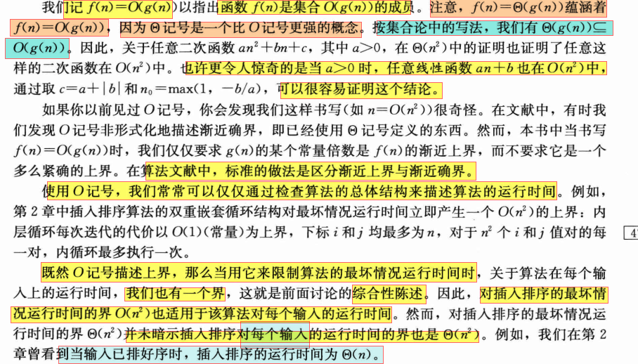

@[toc]

# algorithm_算法分析引入的记号:复杂度分析符号

##  $T(n):$算法的运行时间

## $f(n)$:输入规模和关于输入规模的函数

- $问题输入规模n$

- $输入规模的函数,形如f(n),也可以记作其他符号g(n)等$
- 输入规模的最佳概念依赖于研究的问题。
  - 对许多问题，如排序或计算离散傅里叶变换，最自然的量度是输入中的**项数**，
    - 例如，待排序数组的规模n,
  - 对其他许多问题，如*<u>两个</u>整数相乘*，输入规模的<u>最佳量度</u>是用通常的<u>二进制记号表示输入所需的总位数</u>。
- 有时，用**两个数**而不是一个数来**描述输入规模**可能更合适。
  - 例如，若某个算法的输入是一个**图**，则输入规模可以用该**图中的顶点数和边数**来描述。

## ($\Theta,O,\Omega$):常用的三种记号:

- (a)$\Theta$记号限制一个函数在**常量因子内的上下确界**。

  - $$如果存在正常量n_0、c_1、和c_2，使得在n及其右边,
\\有f(n)的值总位于c_1\cdot g(n)与c_2\cdot g(n)之间或等于它们,
\\那么记f(n)=\Theta(g(n))。$$

- (b)$O$记号为函数给出一个在**常量因子内的<u>上界</u>**。

  - $$
    如果存在正常量n_o和 c，使得在n及其右边，
    \\f(n)的值总小于或等于cg(n)，那么记fn)=Og(n))。
    $$

    

- (c)$\Omega$记号为函数给出一个在常量因子内的下界。

  - $$
    如果存在正常量n_0和c，使得在n_0及其右边，f(n)的值总大于或等于cg(n)，
    \\那么记f(n)=\Omega(g(n))
    $$

### 关系小结

- $$
  我们记f(n)=O(g(n))以指出f(n)是集合O(g(n))函数集合的成员
  \\若f(n)=\Theta(g(n)),则总是有f(n)=O(g(n)),
  \\因为\Theta(渐进确界)是一个比O记号更加确界和约束明明显的概念
  \\\bigstar 按照集合论中的写法,其表达的就是\Theta(g(n))\subseteq O(g(n))
  $$

  

##  Θ(渐进紧确界)

## $\bigstar$为什么用等号?

- $这里g(n)往往是一个简单的式子(比如n,n^2 等)$
  - $函数g(n)主要用来描述边界曲线,这往往用简化的函数来描述就足够了$

- $而f(n)往往会较g(n)来的长一些,比如an^2+bn+c;$

##  theorem:($\Theta,O,\Omega$)

- 

- 话句话说

  - $$
    对于满足f(n)=O(g(n))并且f(n)=\Omega(g(n))两个条件的
    \\任意两个函数f(n),g(n),
    \\那么总是可以推出确界关系f(n)=\Theta(g(n))
    $$

    

  - 类似于`夹逼原理`

##  O记号:

- 该记号可以用于粗略反映描述**最坏的情况**

- $对于给定的函数g(n)$

- 由定义可见,对于例子$g(n)=n^{2}$,我们可以说$f(n)=n$属于集合$O(g(n))=O(n^{2})$
- $O(g(n))是一个函数集合$
- 

## Ω记号:

- 
  - ​		后半句话中,应把$Ω(n^{2})视为函数f(n)的集合$

##  等式和不等式中的渐进记号

##  o记号:

##  $\omega$记号
