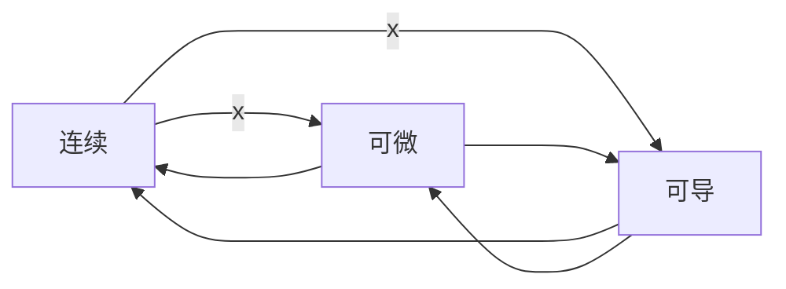

[toc]

- 间断点@连续@可导@可微@微积分基本定理

# 间断点

## 第一类间断点

### 跳跃间断点

- 函数的**跳跃间断点**只和某点(比如$x=x_0$处的左右极限有关,而和函数$f(x)$在$x=x_0$有无定义或取值**都无关**

### 可去间断点

- 另一个第一类间断点类别(可去间断点)

  - $f(x)在x=x_0的某个去心邻域\mathring{U}(x_0,\delta)内有定义$

  - $L_{x_0}=\lim\limits_{x\to{x_0}}f(x)$存在

    - $$
      即:\lim_{x\to{x_0^{-}}}f(x)=\lim_{x\to{x_0^+}}f(x)=L_{x_0}时
      \\
      才有:L_{x_0}=\lim\limits_{x\to{x_0}}f(x)
      $$

    - 往往分段函数有可能存在这类可去间断点

      - $$
        {\displaystyle f(x)=
        {\begin{cases}
        1&{\text{if }}x=0,
        \\x^2&{\text{if }}x\neq 0.
        \end{cases}}}
        $$

  - 且$f(x_0)\neq{L_{x_0}}$或$f(x)在x=x_0$处无定义,都属于<u>可去间断点</u>

- $$
  \lim_{x\to{x_0^{-}}}f(x)=f(x_0^{-})=A
  \\
  \lim_{x\to{x_0^{+}}}f(x)=f(x_0^{+})=B
  \\A\neq{B}
  $$

### 例

- 可去间断点

  - $f(x)=\frac{\sin{x}}{x}$
    - 在x=0处左右极限都为1
    - $如果补充定义f(1)=1$,则$f(x)$在R上连续
  
- 跳跃间断点的案例($x=x_0=0$处)

  - 处处有定义,但是某点的极限不存在的案例:

  - $$
    {\displaystyle \operatorname {sgn} 
    (x):={\begin{cases}-1&{\text{if }}x<0,
    \\0&{\text{if }}x=0,
    \\1&{\text{if }}x>0.
    \end{cases}}}
    $$

  - $$
    {\displaystyle \operatorname {g} 
    (x)={\begin{cases}-1&{\text{if }}x<0,
    \\1&{\text{if }}x>0.
    \end{cases}}}
    $$

## 第二类间断点

- 如果$f(x)在x=x_0的某个去心邻域\mathring{U}(x_0,\delta)内有定义$

  - $$
    \lim_{x\to{x_0^{-}}}f(x)和\lim_{x\to{x_0^{+}}}f(x)至少有一个\huge不存在
    \\
    称x=x_0为f(x)的第二类间断点
    $$

  - 第二类间断点由可以分为

    - 无穷间断点
      - 例如:$f(x)=\frac{1}{x}$
    - 振荡间断点
      - 例如:$g(x)={\sin\frac{1}{x}}$,在x=0处为振荡间断点
        - 
    - ...

    

# 连续@可导@可微

## 一元函数

- 一元函数中
  - 可导可以推出连续和可微
  - 可微可以推出连续和可导
  - 连续推不出可到,也推不出可微

## 多元函数

- 可导推不出连续也推不出可微

  - 因为多元函数可导是指,一阶偏导存在

  - 多元函数的偏导数是利用一元函数定义的

    - $$
      f'_{x}(x_0,y_0)=\lim\limits_{x\to{x_0}}\frac{f(x,y_0)-f(x_0,y_0)}{x-x_0}
      \\
      f'_{y}(x_0,y_0)=\lim\limits_{y\to{y_0}}\frac{f(x_0,y)-f(x_0,y_0)}{y-y_0}
      $$

    - 其动点$(x,y_0)或(x_0,y)$是沿着x(或者y)轴方向趋近于$(x_0,y_0)$,它只与点$(x_0,y_0)$邻域内的过该点且平行于两坐标轴的十字方向(仅两个方向)函数值有关

  - 多元函数的连续和可微都是用重极限定义的

    - $$
      \lim\limits_{(x,y)\to{(x_0,y_0)}}f(x,y)=f(x_0,y_0)
      \\f(x,y)-f(x_0,y_0)=A(x-x_0)+B(y-y_0)+o(\rho)
      $$

    - 其动点$(x,y)$是以任意方向趋近于$(x_0,y_0)$,它域点$(x_0,y_0)$领域内函数值(所有方向)有关

- 至于可微是可以推出可导和连续的,这一点和一元函数的情况是一样的

## 小结

- 连续是(相较于可导/可微)最弱的条件
  - 在一元函数和多元函数中,都是既无法推出可导也无法推出可微
- 可导相对于可微又弱一些
  - 在一元函数中,可导可以推出连续和可微
  - 但在多元函数中既无法推出连续,也无法推出可微
- 可微是很强的条件
  - 无论是一元函数还是多元函数,都可以同时推出连续和可导
- 二元函数中,如果一阶偏导都**存在且连续**,能够推出可微
  - 但是可微无法推出二元函数的两个一阶偏导都存在且**连续**

### 可微的必要条件

- 如果$z=f(x,y)$在点(x,y)处可微,则该函数在点(x,y)处的偏导数$\frac{\partial{z}}{\partial{x}},\frac{\partial{z}}{\partial{y}}$都必定存在(但是偏导数不一定连续)
- 但是如果两个偏导数都来连续,则必定可微

### 可微的充分条件

- 如果函数$z=f(x,y)$的偏导数$\frac{\partial{z}}{\partial{x}},\frac{\partial{z}}{\partial{y}}$在点$(x,y)$处连续,则函数$z=f(x,y)$在该点可微

# 微积分定理

## 第一基本定理

- 不定积分和定积分的关系

### 变上限积分函数的导数

- $设f(x)在[a,b]上连续$

  - 积分上限的函数$G(x)=\displaystyle{\int_{a}^{x}f(t)dt}$

    - $G(x)在[a,b]上可导$

    - $G'(x)=\frac{d}{dx}\displaystyle{\int_{a}^{x}f(t)dt}=f(x),x\in[a,b]$

      - 注意到定积分下限是$f(x)$的定义区间的下限a

    - 定理表明

      - $$
        \int_{a}^{x}f(t)dt是f(x)(x\in[a<b])的一个原函数
        \\\int f(x)dx=\int_{a}^{x}f(t)dt+C,(x\in[a,b])
        $$

        

  - 证明:

    - 可以分为三个部分进行证明(区间内部@区间左边界@区间有边界)

      - $x\in(a,b)$

      - $x=a$

      - $x=b$

    - $$
      若x\in(a,b),且x+\Delta{x}\in(a,b)
      \\
      记:\Delta{G(x)}=G(x+\Delta{x})-G(x)
      \\=\displaystyle{\int_{a}^{x+\Delta{x}}f(t)dt}-\displaystyle{\int_{a}^{x}f(t)dt}
      \\=\displaystyle{\int_{a}^{x+\Delta{x}}f(t)dt}
      +\displaystyle{\int_{x}^{a}f(t)dt}
      \\=\displaystyle{\int_{x}^{x+\Delta{x}}f(t)dt}
      \\由积分中值定理:
      [x,x+\Delta{x}]存在一点\xi,使得:
      \\
      \Delta{G(x)}=\displaystyle{\int_{x}^{x+\Delta{x}}f(t)dt}=f(\xi)\Delta{x}
      \\
      \frac{1}{\Delta{x}}\Delta{G(x)}
      =\frac{1}{\Delta{x}}\displaystyle{\int_{x}^{x+\Delta{x}}f(t)dt}
      =f(\xi)
      \\\Delta{x}\to{0}时,x+\Delta{x}\to{x}
      \\又因为\xi\in{[x,x+\Delta{x}]},则\xi\to{x}(\Delta{x}\to{0})
      $$

      

    - $$
      由导数的定义(极限),将\xi视为变量
      \\
      G^{'}(x)=\lim_{\Delta{x}\to{0}}\frac{\Delta{G(x)}}{\Delta{x}}
      \\=\lim_{\xi\to{x}}f(\xi)
      \\由于f(x)在[a,b]内是连续的,[x,x+\Delta{x}]\sub(a,b)自然也是连续的
      \\根据一元连续函数的性质,那么有\lim_{\xi\to{x}}f(\xi)=f(x)
      \\\therefore
      G'(x)=\frac{d}{dx}\int_{a}^{x}f(t)dt=f(x)(x\in(a,b)
      $$

    - $$
      进一步分类讨论:
      \\x=a,取\Delta{x}>0;可以得到右导数G'_+(a)=f(a);
      \\x=b,取\Delta{x}<0;左导数:G'_-(b)=f(b)
      \\从而得到G'(x)=f(x)
      $$

      

### 定积分的角度

- $G(x)=\displaystyle{\int_{a}^{x}f(t)dt}=F(x)-F(a)$
  - $G'(x)=\frac{d}{dx}\displaystyle{\int_{a}^{x}f(t)dt}=(F(x)-F(a))'=f(x)$

#### 原函数存在定理😊

- 变上限积分与原函数的关系

- $设f(x)在[a,b]上连续;G(x)=\displaystyle{\int_{a}^{x}f(t)dt}$
  - $G(x)就是f(x)在[a,b]上的一个原函数$

### 应用

- 如果$f(x)$在区间$D=[a,b]$上除了点$x=x_0\in(a,b)$外均连续,而在$x=x_0$出$f(x)$有跳跃间断点:

  - 记

  - $$
    F(x)=\int_{c}^{x}f(t)dt
    $$

  - $\forall c\in{D}$,均有结论

    - $F(x)在[a,b]$上连续
    - $F'(X)=f(x),x\in[a,b],x\neq{x_0}$
    - $F'_{-}(x_0)=f(x_0^-),F'_{+}(x_0)=f(x_0^{+})$

  - 例

    - $$
      f(x)=
      \begin{cases}
      \sin{x},x\leqslant{0}
      \\
      e^x,x>0
      \end{cases}
      \\
      记:F(x)=\int_{-\pi}^{x}f(t)d{t}
      $$

    - 分段函数积分

    - $$
      F(x)=\int_{-\pi}^{x}f(t)d{t}=
      \begin{cases}
      \int_{-\pi}^{x}\sin{t}dt=-\cos{x}-1(x\leqslant{0})
      \\
      \int_{-\pi}^{0}\sin{t}dt+\int_{0}^{x}e^tdt=-2+e^{x}-1=e^x-3(x>0)
      \end{cases} 
      $$

      

### 例

- 设$f(x)$在[a,b]上连续,且$f(x)>0$,$G(x)=\int_{a}^{x}f(t)d{t}+\int_{b}^{x}\frac{1}{f(t)}dt$

- 求证

  - $G'(x)\geqslant{2}$
  - 方程$G(x)=0$在$(a,b)$内仅有一个实根

- $对G(x)$两边对x求导

  - $$
    G'(x)=f(x)+\frac{1}{f(x)}
    \\由于f(x)>0
    \\
    再由基本不等式得出G'(x)\geqslant{2}\sqrt{f(x)\cdot{\frac{1}{f(x)}}}=2
    $$

  - $$
    由于G(a)=\int_{b}^{a}\frac{1}{f(t)}dt=-\int_{a}^{b}\frac{1}{f(t)}dt<0
    \\
    G(b)=\int_{a}^{b}f(t)dt>0
    \\故由零点定理知,G(x)=0在(a,b)内至少存在一个根
    \\而G'(x)>0,G(x)在[a,b]上单调增加,所以G(x)=0在(a,b)内仅有一个根
    $$

### 例

- $$
  \lim\limits_{x\to{0}}\left(\frac{1}{x^2}\int_{\cos{x}}^{1}e^{-t^2}d{t}\right)
  $$

  - $$
    容易发现上述极限是\frac{0}{0}型
    \\考虑使用LHopital法则
    \\
    由于(可以令u=\cos{x},符合函数求导)
    \\
    \frac{d}{dx}\int_{\cos{x}}^{1}e^{-t^2}dt
    =-\frac{d}{dx}\int_{1}^{\cos{x}}e^{-t^2}dt
    \\=-\frac{d}{du}\int_{1}^{u}e^{-t^2}dt\cdot{\frac{du}{dx}}
    \\=-(e^{-u^2})(-\sin{x})
    =\sin{x}e^{-\cos^{2}{x}}
    $$

    - $$
      t\in{R}
      \\\cos{t}\in{[-1,1]}
      \\
      被积分函数记为f(t)=e^{-t^2},决定了曲边梯形的曲线
      \\积分上下限没有必然的大小关系
      \\但有时对调调整上下限取反会更加符合习惯和直观
      $$

      

  - $$
    \lim\limits_{x\to{0}}\left(\frac{1}{x^2}\int_{\cos{x}}^{1}e^{-t^2}d{t}\right)
    =\lim_{x\to{0}}\frac{\sin{x}e^{-\cos^2{x}}}{2x}=\frac{1}{2e}
    $$

## 微积分第二基本定理

- 也就是赫赫有名的牛顿-莱布尼兹公式

- 如果$F(x)$是**连续函数**$f(x)$在区间$[a,b]$,上的一个原函数

  - $$
    \int_{a}^{b}f(x)d{x}=f(x)dx=F(b)-F(a)
    $$

- 根据微积分第一基本定理:

  - $$
    G(x)=\int_{a}^{x}f(t)dt
    $$

  - 是连续函数$f(x)$的一个原函数

- 两个原函数$F(x)-G(x)$在$[a,b]$上必定是某个常数C

  - $F(x)-G(x)=C(a\in[a,b])$
  - $G(x)=F(x)+C$

- $$
  G(b)=\int_{a}^{b}f(x)dx
  \\
  G(a)=0
  \\G(b)-G(a)=G(b)
  \\
  \int_{a}^{b}f(x)dx=G(b)-G(a)=[F(b)+C]-[F(a)+C]=F(b)-F(a)
  $$

- $$
  记:\left.F(x)\right|_{a}^{b}=F(b)-F(a)
  \\\int_{a}^{b}f(x)dx=\left.F(x)\right|_{a}^{b}
  $$

## 变限积分求导公式

- 利用微积分第一基本定理以及复合函数求导准则,定积分的分段积分性质,可以得到公式

- $设F(x)=\int_{\phi_1(x)}^{\phi_2{x}}f(t)dt$其中$f(x)在[a,b]$上来连续

- 可到函数$\phi_1(x)和\phi_2(x)$的值域在[a,b]上

  - 其中一个可能是常数,一样适用

- 则函数$\phi_1(x)$和$\phi_2(x)$的公共定义域上有

- $$
  F'(x)=\frac{d}{dx}\int_{\phi_1(x)}^{\phi_2(x)}f(t)dt
  =f(\phi_2(x))\phi'_2(x)-f(\phi_1(x))\phi'_1(x)
  \\=\sum_{i=1}^{2}(-1)^{i}f(\phi_i(x))\phi_i'(x)
  \\展示一下抽象能力😊
  $$

  - 称$x$求导变量

  - 称$t$为积分变量
    $$
    \int_{\phi_1(x)}^{\phi_2(x)}f(t)dt
    =\int_{\phi_1(x)}^{\xi}f(t)dt+\int_{\xi}^{\phi_2(x)}f(t)dt
    \\=-\int^{\phi_1(x)}_{\xi}f(t)dt+\int_{\xi}^{\phi_2(x)}f(t)dt
    \\(\xi\in[a,b])
    \\对两边求导,可得到上述公式
    $$

### 例

- 设$f(x)$具有连续导数,求$S=\frac{d}{dx}\int_{a}^{x}(x-t)f'(t)dt$

  - 首先将求导变量x移出被积分函数$(x-t)f'(t)$

  - $$
    \int_{a}^{x}(x-t)f'(t)dt
    =\int_{a}^{x}xf'(t)dt-\int_{a}^{x}tf'(t)dt
    \\
    =x\int_{a}^{x}f'(t)dt-\int_{a}^{x}tf'(t)dt
    $$

    - 注意到,我们将$\int_{a}^{x}xf'(t)dt=x\int_{a}^{x}f'(t)dt$
    - 因为求导变量对于积分变量t可以视为常数,因此利用定积分的性质,将其提取到积分号之外

  - 对两边求导得到$S=\int_{a}^{x}f'(t)dt+xf'(x)-xf'(x)=f(x)-f(a)$

## 二重积分求导

### 偏导的逆过程

- 设$f(x,y)=x^2y^2$

  - $$
    \frac{\partial{f}}{\partial{x}}=2y^2x
    \\
    \frac{\partial^2{f}}{\partial{x}\partial{y}}
    =\frac{\partial^2{f}}{\partial{y}\partial{x}}=2x\cdot2y=4xy
    $$

    $$
    \int{f(x,y)}dx=4y\times{\frac{1}{2}x^2}=2yx^2
    \\
    \int\left({\int{f(x,y)}dx}\right)dy
    =2x^2\cdot{\frac{1}{2}y^2}=x^2y^2
    $$

    

  - $$
    \frac{\partial^2{}}{\partial{x}\partial{y}}F(x,y)=f(x,y)
    $$

    

### 例

- $$
  F(x)=\int_{0}^{x} d y \int_{0}^{y^{2}} \frac{\sin t}{1+t^{2}} d t \\
  \text { 令 } g(y)=\int_{0}^{y^{2}} \frac{\sin t}{1+t^{2}} d t \\
  F(x)=\int_{0}^{x} g(y) d y, F^{\prime}(x)=g(x)=\int_{0}^{x^{2}} \frac{\sin t}{1+t^{2}} d t \\
  F^{\prime \prime}(x)=g^{\prime}(x)=\frac{2 x \sin x^{2}}{1+x^{4}} 
  $$

  

