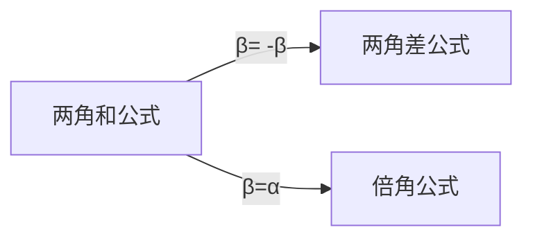

@[toc]
# 三角函数&反三角函数

## 三角理论参考

- [Trigonometric functions - Wikipedia](https://en.wikipedia.org/wiki/Trigonometric_functions)
- [List of trigonometric identities - Wikipedia](https://en.wikipedia.org/wiki/List_of_trigonometric_identities)
- [三角恒等式 - 维基百科](https://zh.wikipedia.org/wiki/三角恒等式#积化和差与和差化积恒等式)

## wikipedia中文简练版

*   [1历史](https://zh.wikipedia.org/wiki/%E4%B8%89%E8%A7%92%E5%87%BD%E6%95%B0#%E5%8E%86%E5%8F%B2)
*   [2几何定义](https://zh.wikipedia.org/wiki/%E4%B8%89%E8%A7%92%E5%87%BD%E6%95%B0#%E5%87%A0%E4%BD%95%E5%AE%9A%E4%B9%89)
    *   [2.1直角三角形中的定义](https://zh.wikipedia.org/wiki/%E4%B8%89%E8%A7%92%E5%87%BD%E6%95%B0#%E7%9B%B4%E8%A7%92%E4%B8%89%E8%A7%92%E5%BD%A2%E4%B8%AD%E7%9A%84%E5%AE%9A%E4%B9%89)
    *   [2.2直角坐标系中的定义](https://zh.wikipedia.org/wiki/%E4%B8%89%E8%A7%92%E5%87%BD%E6%95%B0#%E7%9B%B4%E8%A7%92%E5%9D%90%E6%A0%87%E7%B3%BB%E4%B8%AD%E7%9A%84%E5%AE%9A%E4%B9%89)
    *   [2.3单位圆定义](https://zh.wikipedia.org/wiki/%E4%B8%89%E8%A7%92%E5%87%BD%E6%95%B0#%E5%8D%95%E4%BD%8D%E5%9C%86%E5%AE%9A%E4%B9%89)
*   [3基本性质](https://zh.wikipedia.org/wiki/%E4%B8%89%E8%A7%92%E5%87%BD%E6%95%B0#%E5%9F%BA%E6%9C%AC%E6%80%A7%E8%B4%A8)
    *   [3.1三角恒等式](https://zh.wikipedia.org/wiki/%E4%B8%89%E8%A7%92%E5%87%BD%E6%95%B0#%E4%B8%89%E8%A7%92%E6%81%92%E7%AD%89%E5%BC%8F)
    *   [3.2微积分](https://zh.wikipedia.org/wiki/%E4%B8%89%E8%A7%92%E5%87%BD%E6%95%B0#%E5%BE%AE%E7%A7%AF%E5%88%86)
*   [4分析学定义](https://zh.wikipedia.org/wiki/%E4%B8%89%E8%A7%92%E5%87%BD%E6%95%B0#%E5%88%86%E6%9E%90%E5%AD%A6%E5%AE%9A%E4%B9%89)
    *   [4.1级数定义](https://zh.wikipedia.org/wiki/%E4%B8%89%E8%A7%92%E5%87%BD%E6%95%B0#%E7%B4%9A%E6%95%B8%E5%AE%9A%E7%BE%A9)
        *   [4.1.1与指数函数和复数的联系](https://zh.wikipedia.org/wiki/%E4%B8%89%E8%A7%92%E5%87%BD%E6%95%B0#%E4%B8%8E%E6%8C%87%E6%95%B0%E5%87%BD%E6%95%B0%E5%92%8C%E5%A4%8D%E6%95%B0%E7%9A%84%E8%81%94%E7%B3%BB)
    *   [4.2较少见的三角函数](https://zh.wikipedia.org/wiki/%E4%B8%89%E8%A7%92%E5%87%BD%E6%95%B0#%E8%BE%83%E5%B0%91%E8%A6%8B%E7%9A%84%E4%B8%89%E8%A7%92%E5%87%BD%E6%95%B8)
    *   [4.3微分方程定义](https://zh.wikipedia.org/wiki/%E4%B8%89%E8%A7%92%E5%87%BD%E6%95%B0#%E5%BE%AE%E5%88%86%E6%96%B9%E7%A8%8B%E5%AE%9A%E4%B9%89)
        *   [4.3.1弧度的重要性](https://zh.wikipedia.org/wiki/%E4%B8%89%E8%A7%92%E5%87%BD%E6%95%B0#%E5%BC%A7%E5%BA%A6%E7%9A%84%E9%87%8D%E8%A6%81%E6%80%A7)
    *   [4.4利用函数方程定义三角函数](https://zh.wikipedia.org/wiki/%E4%B8%89%E8%A7%92%E5%87%BD%E6%95%B0#%E5%88%A9%E7%94%A8%E5%87%BD%E6%95%B0%E6%96%B9%E7%A8%8B%E5%AE%9A%E4%B9%89%E4%B8%89%E8%A7%92%E5%87%BD%E6%95%B0)
*   [5计算](https://zh.wikipedia.org/wiki/%E4%B8%89%E8%A7%92%E5%87%BD%E6%95%B0#%E8%AE%A1%E7%AE%97)
    *   [5.1三角函数的特殊值](https://zh.wikipedia.org/wiki/%E4%B8%89%E8%A7%92%E5%87%BD%E6%95%B0#%E4%B8%89%E8%A7%92%E5%87%BD%E6%95%B0%E7%9A%84%E7%89%B9%E6%AE%8A%E5%80%BC)
*   [6反三角函数](https://zh.wikipedia.org/wiki/%E4%B8%89%E8%A7%92%E5%87%BD%E6%95%B0#%E5%8F%8D%E4%B8%89%E8%A7%92%E5%87%BD%E6%95%B0)
*   [7相关定理](https://zh.wikipedia.org/wiki/%E4%B8%89%E8%A7%92%E5%87%BD%E6%95%B0#%E7%9B%B8%E5%85%B3%E5%AE%9A%E7%90%86)
    *   [7.1正弦定理](https://zh.wikipedia.org/wiki/%E4%B8%89%E8%A7%92%E5%87%BD%E6%95%B0#%E6%AD%A3%E5%BC%A6%E5%AE%9A%E7%90%86)
    *   [7.2余弦定理](https://zh.wikipedia.org/wiki/%E4%B8%89%E8%A7%92%E5%87%BD%E6%95%B0#%E4%BD%99%E5%BC%A6%E5%AE%9A%E7%90%86)
    *   [7.3正切定理](https://zh.wikipedia.org/wiki/%E4%B8%89%E8%A7%92%E5%87%BD%E6%95%B0#%E6%AD%A3%E5%88%87%E5%AE%9A%E7%90%86)
    *   [7.4余切定理](https://zh.wikipedia.org/wiki/%E4%B8%89%E8%A7%92%E5%87%BD%E6%95%B0#%E9%A4%98%E5%88%87%E5%AE%9A%E7%90%86)
    *   [7.5周期函数](https://zh.wikipedia.org/wiki/%E4%B8%89%E8%A7%92%E5%87%BD%E6%95%B0#%E5%91%A8%E6%9C%9F%E5%87%BD%E6%95%B0)

### 图像:六种基本的三角函数图像

- 前三种为高中内容
- 后三种为自学内容

### 三角函数的基本内涵

- **三角函数**（英语：Trigonometric functions)是[数学](https://zh.wikipedia.org/wiki/數學)中常见的一类关于[角度](https://zh.wikipedia.org/wiki/角)的[函数](https://zh.wikipedia.org/wiki/函数)。
- 三角函数将[直角三角形](https://zh.wikipedia.org/wiki/直角三角形)的内角与它的两个边的[比值](https://zh.wikipedia.org/wiki/比值)相关联，也可以等价地用与[单位圆](https://zh.wikipedia.org/wiki/单位圆)有关的各种线段的长度来定义。
- 三角函数在研究三角形和圆等几何形状的性质时有重要作用，也是研究振动、波、天体运动以及各种[周期性现象](https://zh.wikipedia.org/wiki/周期函数)的基础数学工具
- 在[数学分析](https://zh.wikipedia.org/wiki/数学分析)中，三角函数也被定义为[无穷级数](https://zh.wikipedia.org/wiki/无穷级数)或特定[微分方程](https://zh.wikipedia.org/wiki/微分方程)的解，允许它们的取值扩展到任意实数值，甚至是[复数](https://zh.wikipedia.org/wiki/複數_(數學))值。

- 不同的三角函数之间的关系可以通过几何直观或者计算得出，称为[三角恒等式](https://zh.wikipedia.org/wiki/三角恒等式)。

- 三角函数一般用于计算[三角形](https://zh.wikipedia.org/wiki/三角形)中**未知长度的边和未知的角度**，在导航、工程学以及物理学方面都有广泛的用途。
- 另外，以三角函数为模版，可以**定义一类相似的函数**，叫做[双曲函数](https://zh.wikipedia.org/wiki/双曲函数)[[2\]](https://zh.wikipedia.org/wiki/三角函数#cite_note-3)。
  - 常见的双曲函数也被称为[双曲正弦](https://zh.wikipedia.org/wiki/双曲正弦)函数、[双曲余弦](https://zh.wikipedia.org/wiki/双曲余弦)函数等等。

### 直角三角形中的定义

### 直角坐标系中的定义

### 单位圆定义(六种基本三角函数)&几何含义

### 特殊角度的三角函数值表

## 三角函数间的诱导公式
###  单位圆坐标和三角函数

- 例如,$sin(\theta+\pi)=- sin(\theta);这里\phi(\theta)=\pi+\theta$
- $途中各个点的横纵坐标分值分别对应p(cox(\phi(\theta)),sin(\phi(\theta)))$
- 途中设定了两个超级点(主超级点为$A(cos\theta,sin\theta),副超级点B(sin\theta,cos\theta)$
	- $所有的其他角度都可以由超级点关于x轴或者y轴或者圆心原点(或者\theta=\frac{\pi}{2})对称$
	- 比如$\phi(\theta)=\theta-\frac{\pi}{2};则sin(\phi(\theta))=-cos\theta;cos(\phi(\theta))=sin\theta$
###  记忆口诀
* 对于$k\frac{\pi}{2}\pm\alpha(k\in \mathbb{Z})$的三角函数值，
#### 符号看象限
- 口诀总是把$\alpha$看作锐角，$2π-α∈(270°，360°),弧度角2\pi-\alpha终边落在第4象限，sin(2π-α)<0$，符号为“-”
####  奇变偶不变
①当k是偶数时，得到α的同名函数值，即函数名不改变；
②当k是奇数时，得到α相应的余函数值，即sin→cos;cos→sin;tan→cot,cot→tan。（奇变偶不变）然后在前面加上把α看成锐角时原函数值的符号。（符号看象限）
例如：
$sin(2π-α)=sin(4·\frac{\pi}{2}-α)$，k=4为偶数，所以函数名(绝对值部分)是sinα。

所以$sin(2π-α)=-sinα$
####  又例

* 例如,$sin(\frac{\pi}{2}+\alpha)=+cos\alpha$
### 基本&常用诱导公式

#### 😎常用部分(5对)

- 可以用坐标系中的单位圆来理解,此外
- 第1行可以由奇偶性性质得到
- 第2/3行可以单位圆对称性(坐标值),或者函数平移关系得到,注意到函数名发生了变化(正弦和余弦相互转换)
	-  知道其一,可以直接将 $\alpha=-\alpha$导入,求出另一个,
	- 例如$sin(\frac{\pi}{2}+\alpha)=sin(\frac{\pi}{2}-(-\alpha))=cos(-\alpha)=cos(\alpha)$
- 第5行则可以由单位圆的对称性给出

- 数形结合,利用对对称性来理解$sin(\theta),sin(\pi\pm\theta),sin(2\pi-\theta)$ 4个值间的关系
- 类似的可以得出$cos\theta$及其变体
  

####  倒数关系
- 其中(1,6);(2,5);(3,4)各对之间的乘积为1(对于同一个θ角)
$$
 正弦(sine)\times余割(co-secant)=1
 \\正割(secant)\times余弦(co-sine)=1
\\ 正切(tangent)\times余切(co-tangent)=1
$$

| tan·gent   | co·tan·gent  | se·cant             | co·se·cant  |
| ---------- | ------------ | ------------------- | ----------- |
| /ˈtanjənt/ | /kōˈtanjənt/ | /ˈsēˌkant,ˈsēˌkənt/ | /kōˈsēkənt/ |
| 正切       | 余切         | 正割                | 余割        |

####  六种三角函数间的转换关系
- 正弦余弦&正割余割&正切余切间的转换($\frac{\pi}{2}$)

### 更多(Reflections, shifts, and periodicity)

- $cos\alpha=cos(\frac{\pi}{2}-\theta)=sin\theta$

- 更一般的,当$\alpha+\beta=\frac{\pi}{2}$时,有

  - $$
    cos\alpha=sin\beta
    \\
    sin\alpha=cos\beta
    $$
####  $\frac{\pi}{2}-\alpha$:关于$y=x$对称
- 关于$y=x$对称的两点$P1,P2$坐标关系:
- $x_{p1}=y_{p2}$
- $x_{p2}=y_{p1}$

​    

#### Reflections( $\frac{\pi}{2}\pm\alpha;\pm \alpha)$

#### Shifts and periodicity

## 三角恒等式&三角函数相关公式定理

### 三角恒等式

- 不同的三角函数之间存在很多对任意的角度取值都成立的等式，被称为三角恒等式。其中最著名的是**毕达哥拉斯恒等式**，它说明对于任何角，正弦的平方加上余弦的平方总是1[[1\]](https://zh.wikipedia.org/wiki/三角函数#cite_note-微积分-2)。

- 这可从斜边为1的直角三角形应用[勾股定理](https://zh.wikipedia.org/wiki/勾股定理)得出。用符号形式表示，毕达哥拉斯恒等式为：

  - $$
    sin^2x+cos^2x=1
    $$

    两边同除以$sin^2x$
    $$
    1+cot^2x=csc^2x
    $$
    

    两边同除以$cos^2x$
    $$
    tan^2x+1=sec^2x
    $$

  > 三个恒等式和x都和1有密切关系

  

### Parity(奇偶性)

> (只有cos&sec是偶函数,其余都是奇函数)

- The cosine and the secant are [even functions](https://en.wikipedia.org/wiki/Even_function); 
- the other trigonometric functions are [odd functions](https://en.wikipedia.org/wiki/Odd_function). That is:

> - *See also:* [Proofs of trigonometric identities § Angle sum identities](https://en.wikipedia.org/wiki/Proofs_of_trigonometric_identities#Angle_sum_identities)*, and* [Small-angle approximation § Angle sum and difference](https://en.wikipedia.org/wiki/Small-angle_approximation#Angle_sum_and_difference)

### 两角和差公式Angle sum and difference identities

- These are also known as the *angle addition and subtraction theorems* (or *formulae*).

-   
#### 几何含义
-

- 为了描述上的方便,我们采用顶点字母来描述线段
- 上图是在一个矩形ABCD,具有如下特点
  - AEFD是一个直径为1的园的内接四边形(DE=1,DE是一条直径)
  - 分别作:
    - AE的延长线(记为直线L1)
    - 经过点D且与AE平行的直线(记为直线L2)
    - 经过F点的且与AD平行的直线(记为直线L3)
  - L1&L2和L3分贝相交于B,C两点
  - 这样,我们就得到了矩形ABCD的四个点,确定下来了具有一定特征的一个矩形(可以用来演示倍角公式的推导)
- 前面说到,矩形内的一条线段DE的长度为1,这很重要,(相当于利用单位圆来描述基本的x=cosx,y=sinx)
- 基于这个矩形(不失一般性的)以及内部的各个边(主要是该图中的4个RT三角形),可以求各条线段的长度:
  - $\bigtriangleup DEF$中,由于DE=1,$\angle EDF=\beta,EF=sin\beta;DF=cos\beta$,
  - 记$\angle CDF=\alpha$,则$sin\alpha=\frac{CF}{DF}=\frac{CF}{cos\beta}$
    - 可见,$CF=\sin\alpha\cos\beta$
  - 类似的,利用
    - 平行线内错角相等以及
    - 三角形内角和相等(180度)
    - 平行四边形对边相等长等结论
  - 可以推出各条边关于$\alpha,β,\alpha+\beta$之间,cos&sin值间的关系
    - 例如,利用对边相等CD=AB=AE+EB,对应$\cos\alpha\cos\beta=\cos(\alpha+\beta)+\sin\alpha\sin\beta$,
      - 经过移向,可以写成这样的形式(公式形式):$\cos(\alpha+\beta)=\cos\alpha\cos\beta-\sin\alpha\sin\beta$
  - 将β取值-β,带入和角公式,得到两角差公式

### 倍角公式

> When the two angles are equal, the sum formulas reduce to simpler equations known as the [double-angle formulae](https://en.wikipedia.org/wiki/Double-angle_formulae).

$$
\tan2x=\frac{2sinx\cos x}{cos^2x-sin^2x}
=\frac{\frac{2sinxcosx}{cos^2x}}{\frac{cos^2x}{cos^2x}-\frac{sin^2x}{cos^2x}}
=\frac{2tanx}{1-tan^2x}
$$

#### 倍角公式的几何示意图

###  三角函数积分
- These identities can be used to derive the [product-to-sum identities](https://en.wikipedia.org/wiki/Product-to-sum_identities).

- The [derivatives](https://en.wikipedia.org/wiki/Derivative) of trigonometric functions result from those of sine and cosine by applying [quotient rule](https://en.wikipedia.org/wiki/Quotient_rule). (分式(除式)求导规则)
- The values given for the [antiderivatives](https://en.wikipedia.org/wiki/Antiderivative) in the following table can be verified by differentiating them. 
- The number *C* is a [constant of integration](https://en.wikipedia.org/wiki/Constant_of_integration).

- this is the [tangent half-angle substitution](https://en.wikipedia.org/wiki/Tangent_half-angle_substitution), which reduces the computation of [integrals](https://en.wikipedia.org/wiki/Integral) ( [ˈɪntɪɡrəl]积分)and [antiderivatives](https://en.wikipedia.org/wiki/Antiderivative) (不定积分)of trigonometric functions to that of rational fractions.

### 反三角函数

[反三角函数  (wikipedia.org)](https://zh.wikipedia.org/wiki/反三角函数)

### 反三角函数图像

|                                                              |                                                              |                                                              |
| ------------------------------------------------------------ | ------------------------------------------------------------ | ------------------------------------------------------------ |
|  |  |  |

 |

         

### 反三角函数的定义域&值域

## 积化和差与和差化积

### sum-to-product(和差化积)

### 简化推导过程&记忆负担

- 下面将会从代数的角度和几何的角度分别推导和差公式
- 推导$sin(\alpha)\pm sin(\beta)$的时候,用的原始方法
- 推导$cos(\alpha)\pm cos(\beta)$的时候,我们引入$p,q$中间变量来简化推导过程的书写负担

#### 代数方法

##### $sin(\alpha)\pm sin(\beta)$

$$
sin(\alpha)
=sin(
\frac{\alpha+\beta}{2}
+
\frac{\alpha-\beta}{2}
)
\\=sin(\frac{\alpha+\beta}{2})cos(\frac{\alpha-\beta}{2})
+cos(\frac{\alpha+\beta}{2})sin(\frac{\alpha-\beta}{2})
$$

$$
sin(\beta)=sin(\frac{\alpha+\beta}{2}-\frac{\alpha-\beta}{2})
\\=sin(
\frac{\alpha+\beta}{2}
+
\frac{\alpha-\beta}{2}
)
\\=sin(\frac{\alpha+\beta}{2})cos(\frac{\alpha-\beta}{2})
-cos(\frac{\alpha+\beta}{2})sin(\frac{\alpha-\beta}{2})
$$

- 上述两个式子相加/相减,可以分别得到正弦函数和/差公式

- 为了方便讨论,我们将记$2p=\alpha+\beta;2q=\alpha-\beta$
  - 即,$p=\frac{\alpha+\beta}{2};q=\frac{\alpha-\beta}{2}$

- 实际上,如果知道
  $$
  sin(\alpha)+sin(\beta)=2sin(p)cos(q)
  \\由于sin(x)是奇函数(即-sin(x)=sin(-x)),从而可以得到:
  \\sin(\alpha)-sin(\beta)=sin(\alpha)+sin(-\beta),导入导上一个公式,即可展开乘积的形式:
  \\=2sin(q)cos(p);(p\&q发生调换)
  $$

##### $cos(\alpha)\pm cos(\beta)$

- 和$sin(\alpha)+sin(\beta)$具有相类似的技巧

$$
cos(\alpha)+cos(\beta)=2cos(p)cos(q)
\\
cos(\alpha)=cos(p+q)=cos(p)cos(q)-sin(p)sin(q)
\\
cos(\beta)=cos(p-q)=cos(p)cos(q)+sin(p)sin(q)
\\上述两式相加:
cos(\alpha)+cos(\beta)=2cos(p)cos(q)
cos(\alpha)-cos(\beta)=-2sin(p)sin(q)
$$

#### 几何方法推导

下方的示意图中,有
$$
cos\theta+cos\varphi=2cos(p)cos(q)=2EF
\\
\triangle AFG\cong\triangle FCE
\\
AG=FE
\\
cosp=\frac{AG}{AF}=\frac{AG}{cosq}
\\
\Rightarrow AG=cosp\times cosq
$$

#### 和(差)化积示意图

- Diagram illustrating **sum-to-product** identities for sine and cosine. 

- The blue right-angled triangle has angle and the red right-angled triangle has angle . 

- Both have a hypotenuse of length 1. 

  - Auxiliary angles, here called and , are constructed such that and . 
  - Therefore, and . 
  - This allows the two **congruent**(重合一致) purple-outline triangles and to be constructed, each with hypotenuse and angle at their base. 
  - The sum of the heights of the red and blue triangles is , and this is equal to twice the height of one purple triangle,
    -  i.e. . Writing and in that equation in terms of and yields the sum-to-product identity for sine.
    -  Similarly, the sum of the widths of the red and blue triangles yields the corresponding **identity** for cosine.

- $\varphi=p-q;\theta=p+q;p>q$

- $$
  p=\frac{\theta+\varphi}{2}
  \\
  q=\frac{\theta-\varphi}{2}
  $$

  

### product-to-sum (积化和差)

- 其推导和前面的`和差化积`类似的技巧
- 引用`p,q`中间变量:为了方便讨论,我们将记$2p=\alpha+\beta;2q=\alpha-\beta$
  - 即,$p=\frac{\alpha+\beta}{2};q=\frac{\alpha-\beta}{2}$

- $$
  sin(2p)=sin(\alpha)cos(\beta)+cos(\alpha)sin(\beta)
  \\
  sin(2q)=sin(\alpha)cos(\beta)-cos(\alpha)sin(\beta)
  $$

#### $sin(\alpha)cos(\beta)\& cos(\alpha)sin(\beta)$

$$
\\sin(2p)+sin(2q)=2sin(\alpha)cos(\beta)
\\从而:
\\sin(\alpha)cos(\beta)=\frac{1}{2}(sin(2p)sin(2q))
$$

$$
\\sin(2p)-sin(2q)=2cos(\alpha)sin(\beta)
\\从而:
\\cos(\alpha)sin(\beta)=\frac{1}{2}(sin(2p)-sin(2q))
$$

#### $cos(\alpha)cos(\beta)\& sin(\alpha)cos(\beta)$

- 这两个公式具有类似的推导技巧
## 线性组合

## 反三角函数的恒等式

##  refencen

### glossary

#### formula&formulae

/ˈfɔːmjʊlə/

*noun*

plural noun: **formulae**

#### identity(恒等式)

- **MATHEMATICS**

  - a transformation that leaves an object unchanged.

  - an element of a set which, if combined with another element by a specified binary operation, leaves that element unchanged.

    noun: **identity element**; plural noun: **identity elements**

- <u>**MATHEMATICS**</u>
  - the **equality** of **two expressions** for all values of the quantities expressed by letters, or an **equation** expressing this, e.g. ( *x* + 1)2 = *x* 2 + 2 *x* + 1.

### 三角函数英文对照

#### Contents

* [1**Notation**](https://en.wikipedia.org/wiki/Trigonometric_functions#Notation)
* [2**Right-angled triangle definitions**](https://en.wikipedia.org/wiki/Trigonometric_functions#Right-angled_triangle_definitions)
* [3**Radians versus degrees**](https://en.wikipedia.org/wiki/Trigonometric_functions#Radians_versus_degrees)
* [4**Unit-circle definitions**](https://en.wikipedia.org/wiki/Trigonometric_functions#Unit-circle_definitions)
* [5**Algebraic values**](https://en.wikipedia.org/wiki/Trigonometric_functions#Algebraic_values)

  * [5.1**Simple algebraic values**](https://en.wikipedia.org/wiki/Trigonometric_functions#Simple_algebraic_values)
* [6**In calculus**](https://en.wikipedia.org/wiki/Trigonometric_functions#In_calculus)

  * [6.1**Definition by differential equations**](https://en.wikipedia.org/wiki/Trigonometric_functions#Definition_by_differential_equations)
  * [6.2**Power series expansion**](https://en.wikipedia.org/wiki/Trigonometric_functions#Power_series_expansion)
  * [6.3**Continued fraction expansion**](https://en.wikipedia.org/wiki/Trigonometric_functions#Continued_fraction_expansion)
  * [6.4**Partial fraction expansion**](https://en.wikipedia.org/wiki/Trigonometric_functions#Partial_fraction_expansion)
  * [6.5**Infinite product expansion**](https://en.wikipedia.org/wiki/Trigonometric_functions#Infinite_product_expansion)
  * [6.6**Relationship to exponential function (Euler's formula)**](https://en.wikipedia.org/wiki/Trigonometric_functions#Relationship_to_exponential_function_(Euler's_formula))
  * [6.7**Definitions using functional equations**](https://en.wikipedia.org/wiki/Trigonometric_functions#Definitions_using_functional_equations)
  * [6.8**In the complex plane**](https://en.wikipedia.org/wiki/Trigonometric_functions#In_the_complex_plane)
* [7**Basic identities**](https://en.wikipedia.org/wiki/Trigonometric_functions#Basic_identities)

  * [7.1**Parity**](https://en.wikipedia.org/wiki/Trigonometric_functions#Parity)
  * [7.2**Periods**](https://en.wikipedia.org/wiki/Trigonometric_functions#Periods)
  * [7.3**Pythagorean identity**](https://en.wikipedia.org/wiki/Trigonometric_functions#Pythagorean_identity)
  * [7.4**Sum and difference formulas**](https://en.wikipedia.org/wiki/Trigonometric_functions#Sum_and_difference_formulas)
  * [7.5**Derivatives and antiderivatives**](https://en.wikipedia.org/wiki/Trigonometric_functions#Derivatives_and_antiderivatives)
* [8**Inverse functions**](https://en.wikipedia.org/wiki/Trigonometric_functions#Inverse_functions)
* [9**Applications**](https://en.wikipedia.org/wiki/Trigonometric_functions#Applications)

  * [9.1**Angles and sides of a triangle**](https://en.wikipedia.org/wiki/Trigonometric_functions#Angles_and_sides_of_a_triangle)
    * [9.1.1**Law of sines**](https://en.wikipedia.org/wiki/Trigonometric_functions#Law_of_sines)
    * [9.1.2**Law of cosines**](https://en.wikipedia.org/wiki/Trigonometric_functions#Law_of_cosines)
    * [9.1.3**Law of tangents**](https://en.wikipedia.org/wiki/Trigonometric_functions#Law_of_tangents)
    * [9.1.4**Law of cotangents**](https://en.wikipedia.org/wiki/Trigonometric_functions#Law_of_cotangents)
  * [9.2**Periodic functions**](https://en.wikipedia.org/wiki/Trigonometric_functions#Periodic_functions)
* [10**History**](https://en.wikipedia.org/wiki/Trigonometric_functions#History)
* [11**Etymology**](https://en.wikipedia.org/wiki/Trigonometric_functions#Etymology)
  