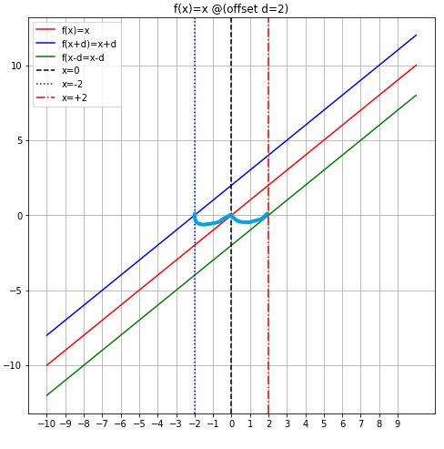

##  坐标系平移

- $设坐标系C_0上有一点p_0^0(m,n)$

- $坐标系C_1上有一点p_0^1(0,0);该点是由p_0^0经过相应的平移映射而来$

- $$
  即,假设平移规则为:c_0坐标的原点移动到c_0的(m,n)位置,
  \\以该位置作为新坐标系c_1的坐标原点(0,0)_{c_1}
  $$

  

  - 
    $$
    (m,n)_{c_0}\to(0,0)_{c_1}
    \\则
    (0,0)_{c_0}\to(-m,-n)_{c1}
    \\则
    (x,y)_{c_0}\to(x-m,y-n)_{c1}
    $$
    

  - 
    $$
    记c_0坐标上的点为(x_0,y_0)
    \\
    c_1坐标上点为(x_1,y_1)
    \\
    \begin{cases}
    x_1=X(x_0)=x_0-m
    \\
    y_1=Y(y_0)=y_0-n
    \end{cases}
    $$
    

  - $$
    对于c_0上的曲线方程B_0:\frac{x_0^2}{a}+\frac{y_0^2}{b}=1
    \\
    对于c_1上的曲线方程B_1:\frac{x_1^2}{a}+\frac{y_1^2}{b}=1
    \\由上述映射关系(参数方程)
    \\B_1在c_0上的方程为:\frac{(x_0-m)^2}{a}+\frac{(y_0-n)^2}{b}=1
    $$

    

  - $$
    同理,可以得到B_0在c_1坐标系上的方程为:\frac{(x_0+m)^2}{a}+\frac{(y_0+n)^2}{b}=1
    \\还比如,可以用容易验证的圆方程R:
    x_1^2+y_1^2=r^2(C_1上)
    \\(x_0-m)^2+(y_0-n)^2=r^2(c_0坐标系投影到C_0上)
    $$

  - 

  - 更一般的,有
    $$
    c_1坐标系(层)上的曲线B(x_1,y_1)=0
    \\
    在c_0坐标系上可以这样描述B(x_0-m,y_0-n)=0
    $$
    

  

  
  $$
  
  $$
  

## 函数的左右平移

- 中学的时候,有句关于函数平移的话:

  - > 我们记平移前的函数为f(x),平移后的函数为g(x)
    >
    > 平移的距离记为**d**

    $$
    f(x)\xRightarrow{平移操作(距离为d)}{g(x)}
    $$

    

  - 左加右减

    - f(x)向左平移,g(x)=f(x+d)
    - f(x)向右平移,g(x)=f(x-d)

  - 上加下减

    - f(x)向上平移,g(x)=f(x)+d
    - f(x)向下平移,g(x)=f(x)-d

  - 

  - 函数图像平移可以理解为,函数图像上的所有点沿着同一个方向平移相同的距离

  - 假设这个距离为d

### 对于右平移

#### 从代数坐标角度来看

- 取图像上的任意一点$A(x_0,f(x_0))$,经过平移后的点$B(x_1,g(x_1))$

  - $$
     x_1=x_0+d
    \\ 则坐标:B(x_1,g(x_1))=(x_0+d,g(x_0+d))
    $$

    

  - 又因为仅仅是水平平移(左/右平移是水平平移),平移前后两个点的纵坐标保持相等

    - $$
      f(x_0)=g(x_1)=g(x_0+d)
      \\即g(x_0+d)=f(x_0)
      $$

      

  - > 这个过程,不失一般性,则

    
    $$
    g(x+d)=f(x)
    $$
    
  
    

- 下面对该式$g(x+d)=f(x)$进行变形

  - 配凑法

    - $$
      \\ 令h(x)=x-d
      \\ 取x=h(x)带入到g(x+d)=f(x),得到g(x-d+d)=f(x-d),从而:
      \\ g(x)=f(x-d)
      $$

      

  - 换元法

    - $$
       不妨令t=x+d,则
      \\ x=t-d
      $$

      

    - 将t,x分别替换

    - $$
      g(t)=f(t-d)
      $$

      

    - 我们将自变量t改写为x,

    - 则
      $$
      g(x)=f(x-d)
      $$
      

- 这就是`右减`的含义

#### 整理:从图像的角度(图像点坐标回退/前进)

图像的角度,更确切的说,是图像上的点的平移的角度来看

- f(x)图像向右平移距离d,得到的图像是函数g(x)的图像

- $g(x)在x=x_0处的坐标A'(x_0,g(x_0))与平移之前的该点本应该处在的位置坐标:A(x_0-d,f(x_0-d))满足如下关系:$

  

  - $A'和A的纵坐标相等$,即
    $$
    g(x_0)=f(x_0-d)
    $$
    
- 该条件是不失一般性的,所以,可以用一般性的x代替具体的$x_0$,从而:
  
- $$
    g(x)=f(x-d)
    $$
  
  

