## 极限

- 

### 例题

- 

  - 本题既可以使用分类讨论来确定,
  - 也可以使用夹逼准则来确定答案(指数函数单调性的模型要注意到!)
  - 

## 函数的极限

- 这里提到的一个$g(x)=xsin(\frac{1}{x})$,其中最值的注意的部分式,在于$x\rightarrow0$的时候,$sin\frac{1}{x}$是在X轴附近震荡,又该函数在该$x\rightarrow 0$的过程是连续的(也就是说,这个函数总是会有若干时刻取值为0,(满足$\frac{1}{x}=n\pi$))的时候,就是g(x)=0的时候,从而,以g(x)为分母的函数在x->0的过程中不是一直连续的

注意,这里的第二重要极限在第一个极限(左极限)的使用,有点技巧,需要将$\frac{1}{x}=-\frac{-1}{x}$

从而:
$$
(1-x)^{\frac{1}{x}}=(1-x)^{-\frac{-1}{x}}=((1-x)^{\frac{-1}{x}})^{-1}=e^{	-1}
$$

- 函数的保号性类似

## $\bigstar$极限的含义&误区和符号梳理

### $\ast$数列和函数的极限的定义小结

### 极限的定义&理解$\rhd$

### 数列极限

$$
\forall \varepsilon>0,\exist N>0, 
\\
when: (n>N)
\\
then:
|x_n-a|<\varepsilon
$$

$$
给定任意\varepsilon
\\确定\delta_{\varepsilon},使得当n>N_{\varepsilon}(其中,n为正整数(表示数列的项的序号)时,即
\\n\in R_{N_\varepsilon}
=(N_{\varepsilon},+\infin)时,保证
能够满足(\varepsilon提出的要求):|x_n-a|<\varepsilon,
\\即满足x_n\in(a-\varepsilon,a+\varepsilon)
$$

- 那么称呼a为数列$x_n在x\rightarrow \infin$时的极限

- $$
  \lim_{n\rightarrow \infin}{x_n}=a
  $$

  

### 邻域&去心邻域&邻域半径

$$
设x_0\in\mathbb{R},\delta\gt0,开区间R_\delta=(x_0-\delta,x_0+\delta)称为\underline{x_0的\delta 邻域},
\\点x_0的\underline{去心\delta邻域}记作\mathring{U}(x_0,\delta),
\\
\delta称为邻域半径(\delta_{radius})
\\
$$

### 间断点🎈

### 函数极限

#### 自变量趋于无穷大时的函数极限

- 函数的极限和数列的极限类似,特别是当$x\rightarrow +\infin$的时候

#### 函数自变量趋于有限值时的函数极限

$$
\forall \varepsilon>0,\exist \delta>0, 
\\
when: (0<|x-x_0|<\delta,(即x_0的去心\delta邻域:\mathring{U}(x_0,\delta)))
\\
then:
|f(x)-a|<\varepsilon;(即,a的\varepsilon邻域{U}(a,\varepsilon),(不去心))
\\则称,f(x)\rightarrow a(x\rightarrow x_0)
$$

##### 简述版

- 函数自变量趋于有限值的函数极限

$$
在x\rightarrow x_0的过程中
\\
给定任意\varepsilon
\\存在(可以确定)\delta_{\varepsilon},使得当x满足0<|x-x_0|<\delta_\varepsilon时,即:
\\\underline{x\in R_{\delta_{\varepsilon}}
=(x_0-\delta_{\varepsilon},x_0+\delta_{\varepsilon})}时,保证
能够满足(\varepsilon提出的要求):|f(x)-a|<\varepsilon,
\\即满足\underline{f(x)\in(a-\varepsilon,a+\varepsilon)}
$$

- 则称呼a为f(x)在自变量$x趋近于x_0$时的极限值:

- $$
  \lim_{x\rightarrow x_0}{f(x)}=a
  $$

  

### 函数极限定义中涉及的4个常数(符号)

- $x_0$:自变量x要趋近的值

  - 自变量x也可能趋近$\infin$

- $\delta$:辅助定义特定区间($R_\delta$或$R_{\delta_\varepsilon}$)的常量

- a:极限值

- $\varepsilon$:极限附近(波动)偏差量允许值

  - $\varepsilon$用于刻画函数f(x)在给定区间内接近极限值a的程度(任意小(任意苛刻)的允许函数值在a附近的波动范围)

  

$$
\delta(为了体现的\delta和\varepsilon之间的联系，我们可以将\delta表示为\delta_{\varepsilon}）用于刻画\underline{特定的条件区间}
\\(为了描述方便,区间记为R_{\delta})
\\(譬如刻画一个邻域)表示,任意小的\varepsilon都能够相应的确定(找到)一个满足条件:
\\(使特定区间R_{\delta_{\varepsilon}}内的函数值相对于极限a的波动(偏移y=a)的距离不超过\varepsilon)
的\varepsilon值
$$

```mermaid
flowchart LR
	A["任意给定ε"]-->B["确定δ"]-->C["区间Rδ"]
	
```

### 极限的符号化描述和其等价的数学语言描述

> 以数列的极限wei'li

- $$
  \lim_{n\rightarrow \infin}{x_n}=a\Longleftrightarrow \forall\varepsilon\gt0,\exist N(N\in N^+(正整数集)),\\
  当n\gt N时,满足|x_n-a|\lt \varepsilon
  $$

  

- $$
  \lim_{x\rightarrow \infin}{x_n}=a\ 表示当n充分大,x_n与a就可以接近到任意`预先给定`的程度
  \\即,|x_n-a|可以小于任意预先给定的\varepsilon
  \\该极限的另一种写法是x_n\rightarrow a(n\rightarrow \infin)
  $$

  - 注意,当ε可以任意取(足够小)的时候,才能够体现极限的意义(它刻画了数列在靠近极限的过程的与极限的接近程度)

  - N和预先给定的$\varepsilon$有关,但是N不是ε的函数(因为同一个ε可以对应多个(甚至无穷多个)符合条件的N)

  - 可以举一个具体的函数例子来辅助理解和辨析

  - 
    $$
    x_n=\frac{1}{n};(x_n=0(x\rightarrow \infin)单调而且有极限0)
    \\
    x_n=\frac{(-1)^{n}}{n};(x_n=0(n\rightarrow \infin)不单调但是有极限0)\\
    $$
    

## 理解极限容易进入的误区&举例

### 趋近于极限的过程不同于该过程的项越来越接近极限

- > 趋近于极限$\not\Leftrightarrow$越来越接近极限

- $$
  \lim_{x_n\rightarrow \infin}x_n=0
  \\我们不能够说,x_n随着n\rightarrow \infin ,x_n越来越接近x_n
  $$

  

- $$
  x_n=\frac{2+(-1)^{n}}{n};(x_n=0(n\rightarrow \infin)数列各项都>0,
  且不单调,但是有极限0)
  $$

  - 这个例子中,$x_1,x_2,x_3,x_4,\dots 分别等于1,\frac{3}{2},\frac{1}{3},\frac{3}{4}$...

  - $$
    x_n=
    \begin{cases}
    \frac{2+(-1)}{n}=\frac{1}{n};n\%2 \not= 0(n为奇数)
    \\
    \frac{2+1}{n}=\frac{3}{n};n\%2=0 (n为偶数)
    \end{cases}
    \\可见,两个子数列都满足x_n\rightarrow0(n\rightarrow\infin);而数列x_n是振荡地趋近于0
    $$

### 越来越接近不同于无限接近

例如
$$
y=\frac{1}{x}+1(x>0)
\\ x\to \infin 的过程越来越接近于y=1(同时趋近于y=1);
\\同时y还越来越接近与y=0,但是无法无线接近于y=0,因为我们可以肯定:y>1;即无法任意接近,
\\顶多是有限的越来越接近
$$

### 极限的几何含义

### 证明保号性

- 

- 更加通俗的讲,,就是,给定(任意狭窄的)波动范围,只要 n>N(n足够大的时候),我们总是能够让n>N之后项值落在与极限a波动范围ε内,进而,**只要a>0**,那么总是能够找到一个ε满足0<ε<a条件(=>0<a-ε)的ε值,即,当$n>N_\varepsilon$ 时,$x_n$总是处在

  > - 一般的,ε先确定,然后再选定出对应的$N_\varepsilon$
  >
  >

- 
  $$
  a-\varepsilon<x_n<a+\varepsilon
  \\前面有提到,0<a-\varepsilon
  \\所以,n>N_\varepsilon时,总是有x_n>0(x_n与数列极限a同为正数)
  $$

- 另外,数列的变化趋势可以时不单调的,
- 但是,ε足够小,相应的,$n>N_\varepsilon$那时起(n足够大之后,)总体上是趋近于极限的,而在那之前(n<N)时,数列可能波动巨大

## 保号性&极限

### 保号性例题(判断极值)

### 分式分母为0?

- 首先,我们考察一下,$y=\frac{x^2}{x}$,该函数和$y=x$的关系是怎样的

### 极值

- 极大值:如果$x_0$处$f(x)$取得极大值,说明两侧的值都小于$f(x_0)$
  - $f(x-\varepsilon)<f(x_0)>f(x+\varepsilon)$

### 	排除法

## 极限存在准则

#### 夹逼法

#### 利用单调有界准测判断收敛/极限

#### ${x_{n+1}}\ \&\ {x_n}$

- 注意,$\{x_{n+1}\}\&\{x_n\}$具有紧密的联系,但是,通项公式确实不同,例如

- $$
  x_n=\frac{2^n}{n!}
  \\
  x_{n+1}=\frac{2^{n+1}}{{(n+1)!}}
  $$

  

$$
\lim\limits_{x\rightarrow \infin}{x_{n+1}}=\lim_{x\rightarrow\infin}{x_n}
$$

- 这是因为,

$$
\\
RHS:x_1,x_2,x_3,\dots,x_n
\\
LHS:l_1,l_2,l_3,\dots,l_n
\\
其中,LHS的各项分别对应于RHS中的 \ x_2,x_3,x_4,\dots,x_{n+1}\\
即,l_1=x_2,l_2=x_3,l_3=x_4,\dots,l_n=x_{n+1}
\\由此可见,数列{x_{n+1}}可以作为x_n的子序列(截取{x_n}第2项开始的后续数列)
$$

#### 使用夹逼小结

- 展开(譬如阶乘/乘方)
- 关于特殊函数的常用不等式(性质)
  - 绝对值不等式
  - 取整函数相关不等式
- 放缩夹逼
  - 在夹逼中,夹逼够不够紧有关系吗?有一定关系,但是不必只求很紧,只需要能够说明问题即可(夹出极限)

## 求和式的极限

### 夹逼

### 积分定义

