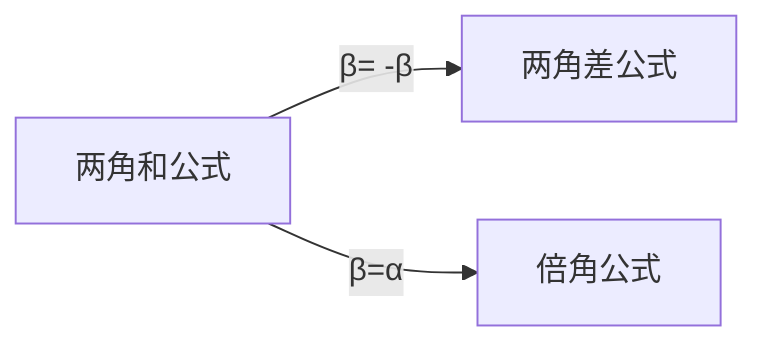

[toc]

# 三角函数

## 图形👺

### 图形:六种基本的三角函数图形🎈

|  |  |      |
| ------------------------------------------------------------ | ------------------------------------------------------------ | ---- |
|                                                              |                                                              |      |

### 三角函数的基本内涵

- **三角函数**（英语：Trigonometric functions)是[数学](https://zh.wikipedia.org/wiki/數學)中常见的一类关于[角度](https://zh.wikipedia.org/wiki/角)的[函数](https://zh.wikipedia.org/wiki/函数)。
- 三角函数将[直角三角形](https://zh.wikipedia.org/wiki/直角三角形)的内角与它的两个边的[比值](https://zh.wikipedia.org/wiki/比值)相关联，也可以等价地用与[单位圆](https://zh.wikipedia.org/wiki/单位圆)有关的各种线段的长度来定义。
- 三角函数在研究三角形和圆等几何形状的性质时有重要作用，也是研究振动、波、天体运动以及各种[周期性现象](https://zh.wikipedia.org/wiki/周期函数)的基础数学工具
- 在[数学分析](https://zh.wikipedia.org/wiki/数学分析)中，三角函数也被定义为[无穷级数](https://zh.wikipedia.org/wiki/无穷级数)或特定[微分方程](https://zh.wikipedia.org/wiki/微分方程)的解，允许它们的取值扩展到任意实数值，甚至是[复数](https://zh.wikipedia.org/wiki/複數_(數學))值。

- 不同的三角函数之间的关系可以通过几何直观或者计算得出，称为[三角恒等式](https://zh.wikipedia.org/wiki/三角恒等式)。

- 三角函数一般用于计算[三角形](https://zh.wikipedia.org/wiki/三角形)中**未知长度的边和未知的角度**，在导航、工程学以及物理学方面都有广泛的用途。
- 另外，以三角函数为模版，可以**定义一类相似的函数**，叫做[双曲函数](https://zh.wikipedia.org/wiki/双曲函数)[[2\]](https://zh.wikipedia.org/wiki/三角函数#cite_note-3)。
  - 常见的双曲函数也被称为[双曲正弦](https://zh.wikipedia.org/wiki/双曲正弦)函数、[双曲余弦](https://zh.wikipedia.org/wiki/双曲余弦)函数等等。

### 直角三角形中的定义

- 对边:Opposite
- 斜边:Hypotenuse
- 临边:Adjacent

- If the acute angle θ is given, then any right triangles that have an angle of θ are similar to each other. This means that the ratio of any two side lengths depends only on θ. Thus these six ratios define six functions of θ, which are the trigonometric functions. In the following definitions, the hypotenuse is the length of the side opposite the right angle, opposite represents the side opposite the given angle θ, and adjacent represents the side between the angle θ and the right angle.[3][4]
  1. sine:
     ${\displaystyle \sin \theta ={\frac {\mathrm {opposite} }{\mathrm {hypotenuse} }}}$
  2. cosecant
     ${\displaystyle \csc \theta ={\frac {\mathrm {hypotenuse} }{\mathrm {opposite} }}}$
  3. cosine
     ${\displaystyle \cos \theta ={\frac {\mathrm {adjacent} }{\mathrm {hypotenuse} }}}$
  4. secant
     ${\displaystyle \sec \theta ={\frac {\mathrm {hypotenuse} }{\mathrm {adjacent} }}}$
  5. tangent
     ${\displaystyle \tan \theta ={\frac {\mathrm {opposite} }{\mathrm {adjacent} }}}$
  6. cotangent
     ${\displaystyle \cot \theta ={\frac {\mathrm {adjacent} }{\mathrm {opposite} }}}$
- In a right-angled triangle, the sum of the two acute angles is a right angle, that is, 90° or $\frac{\pi}{2}$
   radians. Therefore $\sin(\theta )$ and ${\displaystyle \cos(90^{\circ }-\theta )}$ represent the same ratio, and thus are equal. This identity and analogous relationships between the other trigonometric functions are summarized in the following table.

- 直角三角形中仅有锐角（大小在0到90度之间的角）三角函数的定义[6]。指定锐角$\theta$，可以做出直角三角形，使一内角为$\theta$。设三角形中$\theta$的对边、邻边和斜边长度分别是a，b，h，那么
  - $\theta$的正弦是对边与斜边的比值：$\sin{\theta}=\frac{a}{h}$
  - $\theta$的余弦是邻边与斜边的比值：$\cos{\theta}=\frac{b}{h}$
  - $\theta$的正切是对边与邻边的比值：$\tan{\theta}=\frac{a}{b}$
  - $\theta$的余切是邻边与对边的比值：$\cot{\theta}=\frac{b}{a}$
  - $\theta$的正割是斜边与邻边的比值：$\sec{\theta}=\frac{h}{b}$
  - $\theta$的余割是斜边与对边的比值：$\csc{\theta}=\frac{h}{a}$

### 直角坐标系中的定义

- 三角函数也可以依据直角坐标系${\displaystyle xOy}$中半径为1，圆心为原点$O$的单位圆来定义[1]。

- 指定一角$\theta$，设${\displaystyle A(1,0)}$为起始点，如果${\displaystyle \theta >0}$则将${\displaystyle OA}$逆时针转动，如果${\displaystyle \theta <0}$则顺时针移动，直到转过的角度等于$\theta$为止。

- 设最终点A转到的位置为$P(x,y)$，那么：

- | 正弦                             | 余弦                             | 正切                                          | 余切                                          | 正割                                          | 余割                                          |
  | -------------------------------- | -------------------------------- | --------------------------------------------- | --------------------------------------------- | --------------------------------------------- | --------------------------------------------- |
  | ${\displaystyle \sin \theta =y}$ | ${\displaystyle \cos \theta =x}$ | ${\displaystyle \tan \theta ={\frac {y}{x}}}$ | ${\displaystyle \cot \theta ={\frac {x}{y}}}$ | ${\displaystyle \sec \theta ={\frac {1}{x}}}$ | ${\displaystyle \csc \theta ={\frac {1}{y}}}$ |

  

### 单位圆定义

|  |  |      |
| ------------------------------------------------------------ | ------------------------------------------------------------ | ---- |

# 三角恒等式🎈(中学部分)

## 和1相关

- 不同的三角函数之间存在很多对任意的角度取值都成立的等式，被称为三角恒等式。其中最著名的是**毕达哥拉斯恒等式**，它说明对于任何角，正弦的平方加上余弦的平方总是1[[1\]](https://zh.wikipedia.org/wiki/三角函数#cite_note-微积分-2)。

- 这可从斜边为1的直角三角形应用[勾股定理](https://zh.wikipedia.org/wiki/勾股定理)得出。用符号形式表示，毕达哥拉斯恒等式为：

  - $$
    sin^2x+cos^2x=1
    $$

    两边同除以$sin^2x$
    $$
    1+cot^2x=csc^2x
    $$
    

    两边同除以$cos^2x$
    $$
    tan^2x+1=sec^2x
    $$

- 三个恒等式和1有密切关系

## 三角函数基本函数性质

### Parity(奇偶性)

- (只有cos&sec是偶函数,其余都是奇函数)

- The cosine and the secant are [even functions](https://en.wikipedia.org/wiki/Even_function); 

- the other trigonometric functions are [odd functions](https://en.wikipedia.org/wiki/Odd_function). That is:

- $$
  {\displaystyle {\begin{aligned}\sin(-x)&=-\sin x\\
  	\cos(-x)&=\cos x\\
  	\tan(-x)&=-\tan x\\
  	\cot(-x)&=-\cot x\\
  	\csc(-x)&=-\csc x\\
  	\sec(-x)&=\sec x
  	\end{aligned}}}
  $$

  - $\tan{(-x)}$=$\frac{\sin{(-x)}}{\cos{(-x)}}=\frac{-\sin{x}}{\cos{x}}=-\tan{x}$
  
  - $\cot(-x)$=$\frac{\cos{(-x)}}{\sin{(-x)}}$=$-\cot x$
  
  - $\csc{(-x)}=\sin^{-1}(-x)$=$-\sin^{-1}{x}$=$-\csc{x}$
  
  - $\sec{(-x)}$=$\cos^{-1}(-x)$$=\cos^{-1}(x)$=$\sec{x}$
  

### periods周期性

- All trigonometric functions are periodic functions of period $2\pi$. 

- <u>This is the smallest period, except for the **tangent** and the **cotangent**</u>, which have $\pi$ as smallest period. This means that, for every integer k, one has

- $$
  {\displaystyle {\begin{aligned}\sin(x+2k\pi )&=\sin x\\
  	\cos(x+2k\pi )&=\cos x\\
  	\tan(x+k\pi )&=\tan x\\
  	\cot(x+k\pi )&=\cot x\\
  	\csc(x+2k\pi )&=\csc x\\
  	\sec(x+2k\pi )&=\sec x.\end{aligned}}}
  $$

## Sum and difference formulas@和差公式🎈

- The sum and difference formulas allow expanding the sine, the cosine, and the tangent of a sum or a difference of two angles in terms of sines and cosines and tangents of the angles themselves. 
- These can be derived geometrically, using arguments that date to Ptolemy. One can also produce them algebraically using Euler's formula.

### 和

$$
{\displaystyle {\begin{aligned}\sin \left(x+y\right)&=\sin x\cos y+\cos x\sin y,\\[5mu]
	\cos \left(x+y\right)&=\cos x\cos y-\sin x\sin y,\\[5mu]
	\tan(x+y)&={\frac {\tan x+\tan y}{1-\tan x\tan y}}.\end{aligned}}}
$$

### 差

- $$
  {\displaystyle {\begin{aligned}\sin \left(x-y\right)&=\sin x\cos y-\cos x\sin y,\\[5mu]
  	\cos \left(x-y\right)&=\cos x\cos y+\sin x\sin y,\\[5mu]
  	\tan(x-y)&={\frac {\tan x-\tan y}{1+\tan x\tan y}}.\end{aligned}}}
  $$

### 倍角公式🎈

- When the two angles are equal, the sum formulas reduce to simpler equations known as the double-angle formulae.

- $$
  {\displaystyle {\begin{aligned}\sin 2x&=2\sin x\cos x={\frac {2\tan x}{1+\tan ^{2}x}},\\[5mu]
  	\cos 2x&=\cos ^{2}x-\sin ^{2}x=2\cos ^{2}x-1=1-2\sin ^{2}x={\frac {1-\tan ^{2}x}{1+\tan ^{2}x}},\\[5mu]
  	\tan 2x&={\frac {2\tan x}{1-\tan ^{2}x}}.\end{aligned}}}
  $$

  - When the two angles are equal, the sum formulas reduce to simpler equations known as the [double-angle formulae](https://en.wikipedia.org/wiki/Double-angle_formulae).
  - $$
    \tan2x=\frac{2sinx\cos x}{cos^2x-sin^2x}
    =\frac{\frac{2sinxcosx}{cos^2x}}{\frac{cos^2x}{cos^2x}-\frac{sin^2x}{cos^2x}}
    =\frac{2tanx}{1-tan^2x}
    $$
  
    
  
- These identities can be used to derive the product-to-sum identities.
- By setting ${\displaystyle t=\tan {\tfrac {1}{2}}\theta ,}$ all trigonometric functions of $\theta$ can be expressed as rational fractions of $t$:

- $$
  {\displaystyle {\begin{aligned}\sin \theta &={\frac {2t}{1+t^{2}}},\\[5mu]
  	\cos \theta &={\frac {1-t^{2}}{1+t^{2}}},\\[5mu]
  	\tan \theta &={\frac {2t}{1-t^{2}}}.\end{aligned}}}
  $$

### 降幂公式🎈

- $sin^2x=\frac{1}{2}(1-cos2x)$
- $\cos^2x=\frac{1}{2}(1+\cos2x)$

- $sin^2\frac{x}{2}=\frac{1}{2}(1-\cos{x})$

- $cos^2{\frac{x}{2}}=\frac{1}{2}(1+\cos{x})$

- ${d\theta ={\frac {2}{1+t^{2}}}\,dt,}$

- this is the tangent half-angle substitution, which reduces the computation of integrals and **antiderivatives** of trigonometric functions to that of rational fractions.

# 补充

## 相关的几何证明

|  |  |
| ------------------------------------------------------------ | ------------------------------------------------------------ |
| 两角和差                                                     | 倍角                                                         |

### 两角和差公式

- These are also known as the *angle addition and subtraction theorems* (or *formulae*).

#### 几何含义

- 为了描述上的方便,我们采用顶点字母来描述线段
- 上图是在一个矩形ABCD,具有如下特点
  - AEFD是一个直径为1的园的内接四边形(DE=1,DE是一条直径)
  - 分别作:
    - AE的延长线(记为直线L1)
    - 经过点D且与AE平行的直线(记为直线L2)
    - 经过F点的且与AD平行的直线(记为直线L3)
  - L1&L2和L3分贝相交于B,C两点
  - 这样,我们就得到了矩形ABCD的四个点,确定下来了具有一定特征的一个矩形(可以用来演示倍角公式的推导)
- 前面说到,矩形内的一条线段DE的长度为1,这很重要,(相当于利用单位圆来描述基本的x=cosx,y=sinx)
- 基于这个矩形(不失一般性的)以及内部的各个边(主要是该图中的4个RT三角形),可以求各条线段的长度:
  - $\bigtriangleup DEF$中,由于DE=1,$\angle EDF=\beta,EF=sin\beta;DF=cos\beta$,
  - 记$\angle CDF=\alpha$,则$sin\alpha=\frac{CF}{DF}=\frac{CF}{cos\beta}$
    - 可见,$CF=\sin\alpha\cos\beta$
  - 类似的,利用
    - 平行线内错角相等以及
    - 三角形内角和相等(180度)
    - 平行四边形对边相等长等结论
  - 可以推出各条边关于$\alpha,β,\alpha+\beta$之间,cos&sin值间的关系
    - 例如,利用对边相等CD=AB=AE+EB,对应$\cos\alpha\cos\beta=\cos(\alpha+\beta)+\sin\alpha\sin\beta$,
      - 经过移向,可以写成这样的形式(公式形式):$\cos(\alpha+\beta)=\cos\alpha\cos\beta-\sin\alpha\sin\beta$
  - 将β取值-β,带入和角公式,得到两角差公式

##  三角函数积分
- These identities can be used to derive the [product-to-sum identities](https://en.wikipedia.org/wiki/Product-to-sum_identities).

- The [derivatives](https://en.wikipedia.org/wiki/Derivative) of trigonometric functions result from those of sine and cosine by applying [quotient rule](https://en.wikipedia.org/wiki/Quotient_rule). (分式(除式)求导规则)
- The values given for the [antiderivatives](https://en.wikipedia.org/wiki/Antiderivative) in the following table can be verified by differentiating them. 
- The number *C* is a [constant of integration](https://en.wikipedia.org/wiki/Constant_of_integration).

- this is the [tangent half-angle substitution](https://en.wikipedia.org/wiki/Tangent_half-angle_substitution), which reduces the computation of [integrals](https://en.wikipedia.org/wiki/Integral) ( [ˈɪntɪɡrəl]积分)and [antiderivatives](https://en.wikipedia.org/wiki/Antiderivative) (不定积分)of trigonometric functions to that of rational fractions.

## 线性组合@辅助角公式

- 对于某些用途，知道同样周期但**不同相位移动**的正弦波的任何线性组合是有**相同周期**但不同相位移动的正弦波是重要的。
- 在<u>正弦和余弦</u>波的线性组合的情况下，我们有
  - ${\displaystyle a\sin x+b\cos x={\sqrt {a^{2}+b^{2}}}\cdot \sin(x+\varphi )\;(a>0)}$
    - $\varphi =\arctan \left({\frac  {b}{a}}\right)$
  - 这个公式也叫辅助角公式或李善兰公式。
- 更一般的说，对于任何相位移动，我们有:
  - ${\displaystyle a\sin x+b\sin(x+\alpha )=c\sin(x+\beta )\;(a+b\cos x>0)}$
    - $c={\sqrt  {a^{2}+b^{2}+2ab\cos \alpha }},$
    - 而${\displaystyle \beta =\arctan \left({\frac {b\sin \alpha }{a+b\cos \alpha }}\right)}$

#  ref🎈

## 三角理论参考

- [Trigonometric functions - Wikipedia](https://en.wikipedia.org/wiki/Trigonometric_functions)
- [List of trigonometric identities - Wikipedia](https://en.wikipedia.org/wiki/List_of_trigonometric_identities)
- [三角恒等式 - 维基百科](https://zh.wikipedia.org/wiki/三角恒等式#积化和差与和差化积恒等式)
- [三角函数 - 维基百科，自由的百科全书 (wikipedia.org)](https://zh.wikipedia.org/wiki/三角函数)

## 三角函数英文对照

### 特殊角度的三角函数值表

### glossary(术语)

- identity(恒等式)

  - **MATHEMATICS**

    - a transformation that leaves an object unchanged.

    - an element of a set which, if combined with another element by a specified binary operation, leaves that element unchanged.

      noun: **identity element**; plural noun: **identity elements**

  - <u>**MATHEMATICS**</u>
    - the **equality** of **two expressions** for all values of the quantities expressed by letters, or an **equation** expressing this.

