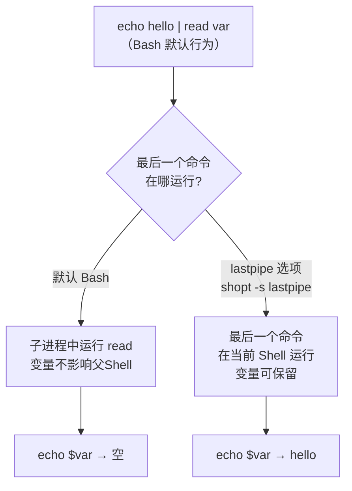

## 特殊情况：最后一个命令在当前 Shell

```mermaid
flowchart TD
    A["echo hello | read var\n（Bash 默认行为）"] --> B{最后一个命令\n在哪运行?}
    B -->|默认 Bash| C[子进程中运行 read\n变量不影响父Shell]
    B -->|lastpipe 选项\nshopt -s lastpipe| D[最后一个命令\n在当前 Shell 运行\n变量可保留]
    C --> E["echo $var → 空"]
    D --> F["echo $var → hello"]
```

---

